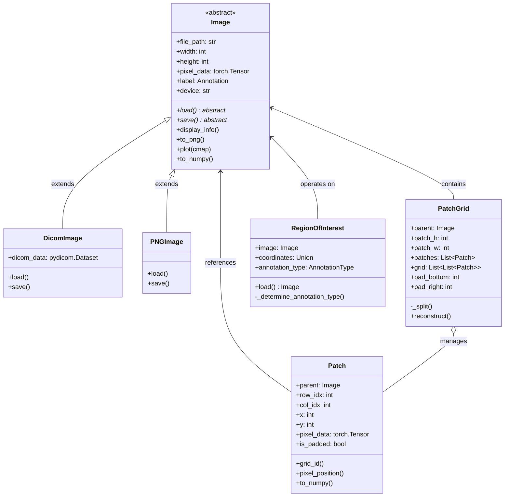
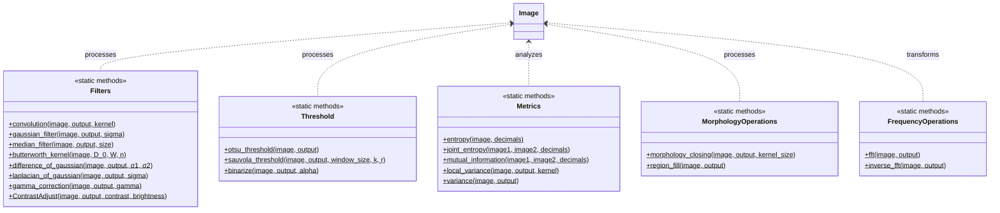
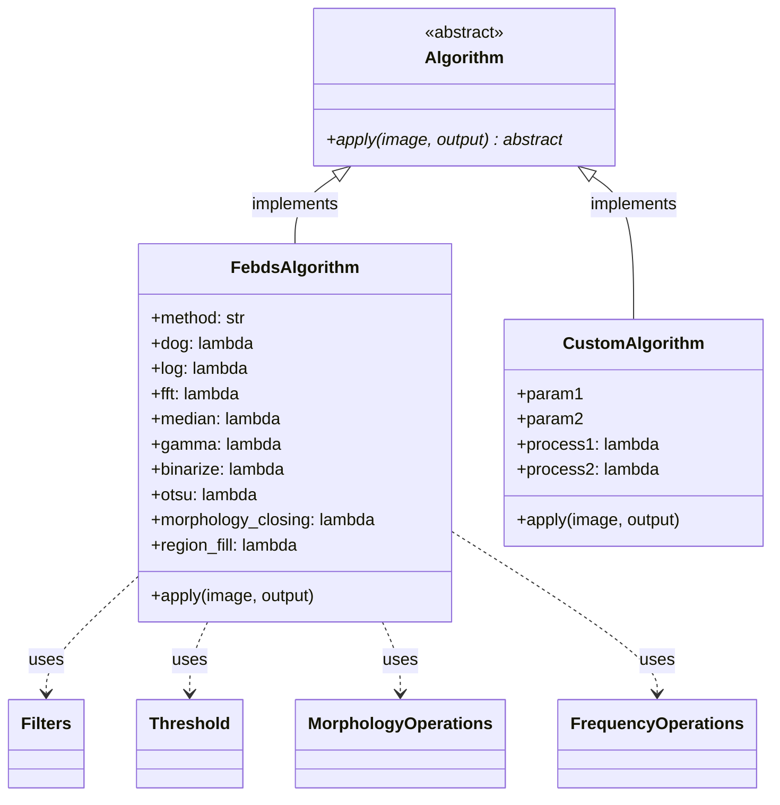
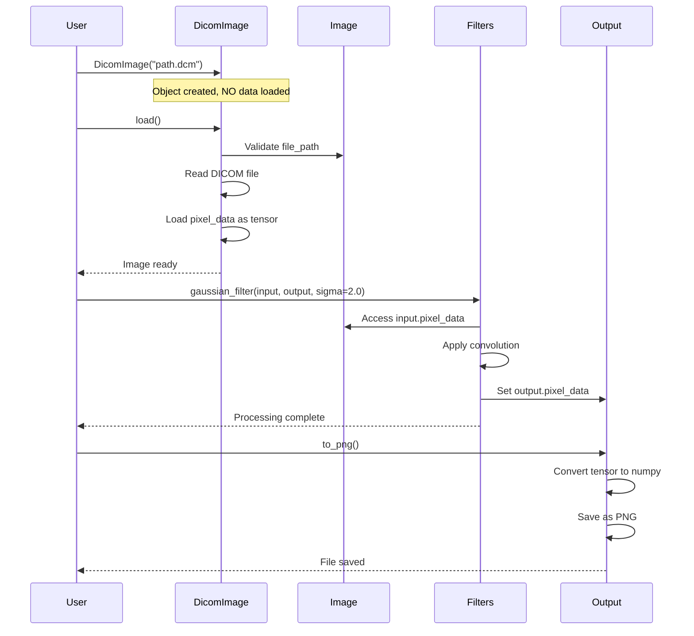
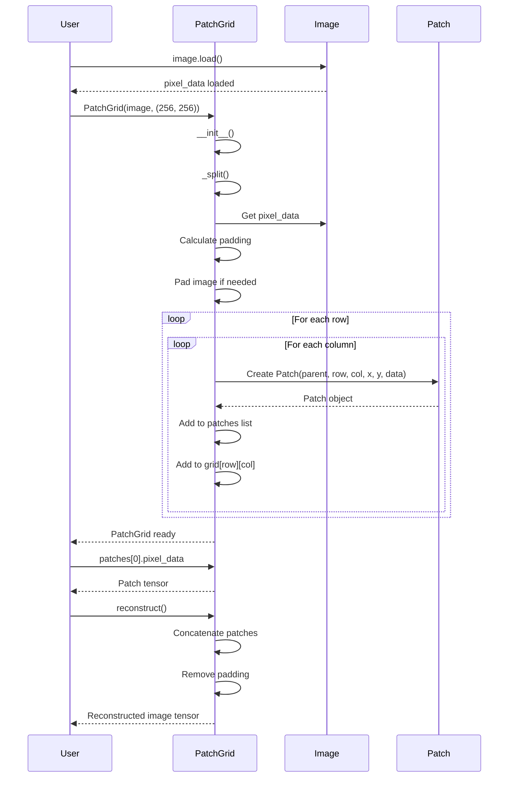
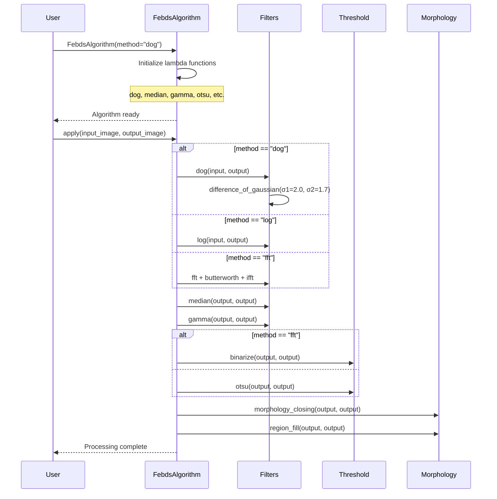
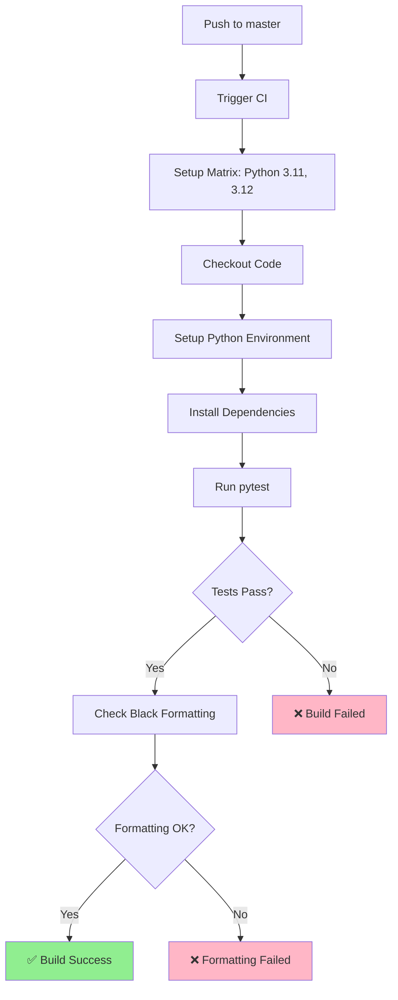

# Medical Image Standard Library Documentation

## Overview

The **Medical Image Standard Library** (`medical-image-std`) is a comprehensive Python library designed to provide **standardized abstractions and processing pipelines** for medical images. The library follows a clean architecture with abstract base classes that define the standard interface, allowing for extensible implementations for different medical image formats (DICOM, PNG, etc.) and processing algorithms.

## Purpose

This library serves as the **foundational standard** for the LATIS DocumentAI Group's medical image processing projects, offering:

- **Standardized Image Abstraction**: Abstract `Image` class defining the core interface for all medical image types
- **Lazy Loading Pattern**: Images load data only when needed via `load()` method, not on instantiation
- **Extensible Processing**: Static methods for filters, thresholding, morphology, and metrics
- **Algorithm Framework**: Abstract `Algorithm` class for defining reusable processing pipelines
- **Patch-based Processing**: `Patch` and `PatchGrid` for efficient large image handling
- **Region of Interest (ROI)**: Support for bounding boxes, polygons, and masks
- **GPU Acceleration**: PyTorch-based tensor operations for performance

---

## Architecture Overview

### Core Design Principles

1. **Abstraction-First**: Define interfaces through abstract base classes
2. **Lazy Loading**: Load image data only when `load()` is called
3. **Composition over Inheritance**: Build complex algorithms from simple processing methods
4. **Static Processing Methods**: Stateless processing functions organized in classes
5. **Extensibility**: Easy to add new image formats, algorithms, and processing methods

### Package Structure

```
medical-image-std/
├── medical_image/
│   ├── data/                # Data structures and abstractions
│   │   ├── image.py         # Abstract Image base class ⭐
│   │   ├── dicom_image.py   # DICOM implementation
│   │   ├── patch.py         # Patch and PatchGrid classes ⭐
│   │   ├── region_of_interest.py  # ROI handling
│   │   ├── medical_dataset.py     # PyTorch Dataset abstraction
│   │   └── annotation.py    # Annotation structures
│   ├── process/             # Processing methods (static)
│   │   ├── filters.py       # Convolution, Gaussian, median, etc.
│   │   ├── threshold.py     # Otsu, Sauvola, variance-based
│   │   ├── morphology.py    # Closing, region filling
│   │   ├── frequency.py     # FFT operations
│   │   └── metrics.py       # Entropy, mutual information
│   ├── algorithms/          # Algorithm framework
│   │   ├── algorithm.py     # Abstract Algorithm base class ⭐
│   │   ├── FEBDS.py         # FEBDS implementation
│   │   └── custom_algorithm.py  # Example custom algorithm
│   └── utils/               # Utilities
│       ├── ErrorHandler.py  # Custom error handling
│       └── annotation.py    # Annotation utilities
├── docs/                    # Documentation
├── tests/                   # Unit tests
└── setup.py                 # Package configuration
```

---

## Class Diagrams

### Data Package Architecture



### Process Package Architecture



### Algorithm Package Architecture



---

## Sequence Diagrams

### Image Loading and Processing Workflow



### PatchGrid Splitting Workflow



### Algorithm Application Workflow (FEBDS)



---

## GitHub CI Workflow

### CI Pipeline Overview

The project uses GitHub Actions for Continuous Integration, defined in `.github/workflows/workflow.yml`.



### CI Workflow Steps

1. **Trigger**: Push to `master` branch
2. **Matrix Strategy**: Test on Python 3.11 and 3.12
3. **Checkout**: Clone repository code
4. **Setup Python**: Install specified Python version
5. **Install Dependencies**: `pip install -r requirements.txt`
6. **Run Tests**: `pytest medical_image/tests/test_dicom.py`
7. **Check Formatting**: `black --check .`
8. **Result**: Build passes only if tests pass AND code is properly formatted

### CI Configuration

```yaml
name: Dicom CI

on:
  push:
    branches:
      - master

jobs:
  build:
    runs-on: ubuntu-latest
    strategy:
      matrix:
        python-version: [3.11, 3.12]

    steps:
    - name: Checkout code
      uses: actions/checkout@v2

    - name: Set up Python ${{ matrix.python-version }}
      uses: actions/setup-python@v2
      with:
        python-version: ${{ matrix.python-version }}

    - name: Install dependencies
      run: pip install -r requirements.txt

    - name: Run tests
      run: pytest medical_image/tests/test_dicom.py

    - name: Check code formatting
      run: black --check .
```

---

## Installation

### Requirements
- Python 3.11 or 3.12
- Linux operating system
- CUDA-compatible GPU (optional, for acceleration)

### Dependencies
- pydicom >= 2.4.4
- numpy >= 1.26.4
- Pillow >= 10.3.0
- torch (with CUDA 12.8 support)
- torchvision
- scipy
- scikit-image
- matplotlib
- pytest (for testing)
- black (for code formatting)

### Install from Source

```bash
# Clone the repository
git clone https://github.com/LATIS-DocumentAI-Group/medical-image-std.git
cd medical-image-std

# Install dependencies
pip install -r requirements.txt

# Install the package
pip install -e .
```

---

## Quick Start

### 1. Loading and Processing Images (Lazy Loading)

```python
from medical_image.data.dicom_image import DicomImage
from medical_image.process.filters import Filters

# Create image object (NO data loaded yet)
image = DicomImage("path/to/mammogram.dcm")

# Load data only when needed
image.load()  # ← Lazy loading happens here

# Display information
image.display_info()

# Process image
output = DicomImage("output.dcm")
Filters.gaussian_filter(image, output, sigma=2.0)

# Save result
output.to_png()
```

### 2. Patch-based Processing

```python
from medical_image.data.patch import PatchGrid

# Load image
image = DicomImage("large_image.dcm")
image.load()

# Create patch grid (calls _split() internally)
patch_grid = PatchGrid(image, patch_size=(256, 256))

# Access patches
print(f"Total patches: {len(patch_grid.patches)}")
print(f"Grid shape: {len(patch_grid.grid)} x {len(patch_grid.grid[0])}")

# Process each patch
for patch in patch_grid.patches:
    # Process patch.pixel_data
    pass

# Reconstruct full image
reconstructed = patch_grid.reconstruct()
```

### 3. Using Algorithms

```python
from medical_image.algorithms.FEBDS import FebdsAlgorithm

# Create algorithm with lambda functions defined in __init__
febds = FebdsAlgorithm(method="dog")

# Apply algorithm (executes sequence of lambda functions)
output = DicomImage("segmentation.dcm")
febds.apply(input_image, output)
```

### 4. Region of Interest

```python
from medical_image.data.region_of_interest import RegionOfInterest

# Define ROI
bbox = [100, 100, 400, 400]  # [x_min, y_min, x_max, y_max]
roi = RegionOfInterest(image, bbox)

# Extract ROI
cropped_image = roi.load()
cropped_image.plot()
```

---

## Documentation

- **[API Reference](docs/api_reference.md)**: Complete API documentation
- **[User Guide](docs/user_guide.md)**: Tutorials and examples
- **[Algorithm Reference](docs/algorithms.md)**: Algorithm details and theory
- **[Dataset Guide](docs/datasets.md)**: Working with medical datasets
- **[Contributing](docs/contributing.md)**: Development guidelines
- **[Quick Reference](docs/quick_reference.md)**: Code snippets cheat sheet

---

## Key Concepts

### Lazy Loading Pattern

Images follow the lazy loading principle:
- **Object Creation**: `image = DicomImage("path.dcm")` - Only stores path
- **Data Loading**: `image.load()` - Loads pixel data into memory
- **Processing**: Operations work on loaded data
- **Saving**: `image.save()` or `image.to_png()`

### Static Processing Methods

All processing operations are static methods organized in classes:
- **Filters**: Convolution, Gaussian, median, DoG, LoG, etc.
- **Threshold**: Otsu, Sauvola, variance-based
- **Morphology**: Closing, region filling
- **Metrics**: Entropy, mutual information, variance

### Algorithm Framework

Algorithms are defined by:
1. **`__init__`**: Define lambda functions for each processing step
2. **`apply`**: Execute sequence of lambda functions

Example:
```python
class CustomAlgorithm(Algorithm):
    def __init__(self):
        self.step1 = lambda img, out: Filters.gaussian_filter(img, out, sigma=2.0)
        self.step2 = lambda img, out: Threshold.otsu_threshold(img, out)
    
    def apply(self, image, output):
        self.step1(image, output)
        self.step2(output, output)
```

---

## Testing

Run tests with pytest:

```bash
# Run all tests
pytest

# Run specific test file
pytest medical_image/tests/test_dicom.py

# Run with coverage
pytest --cov=medical_image
```

---

## Code Formatting

The project uses Black for code formatting:

```bash
# Format code
black medical_image/

# Check formatting (used in CI)
black --check .
```

---

## License

MIT License - See LICENSE file for details

---

## Authors

- Hamza Gbada (hamza.gbada@gmail.com)
- Karim Kalti (karim.kalti@fsm.rnu.tn)

---

## Repository

https://github.com/LATIS-DocumentAI-Group/medical-image-std

---

## Version

Current version: 0.2.8.dev1
