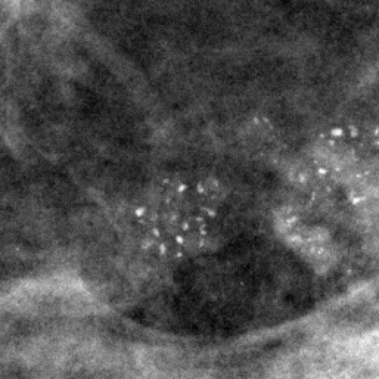
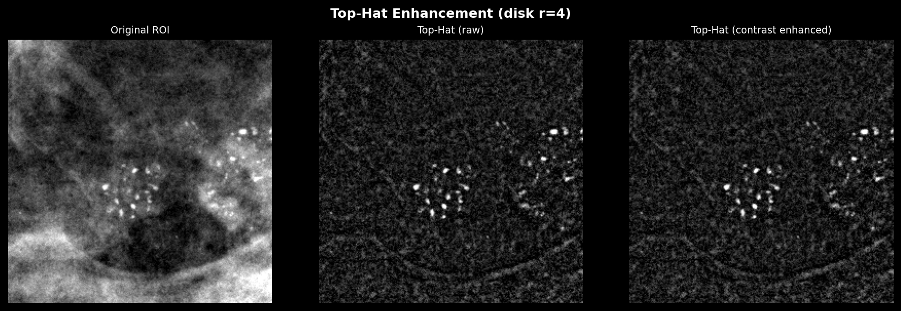
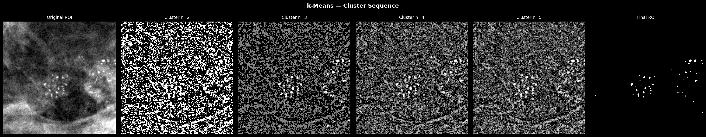
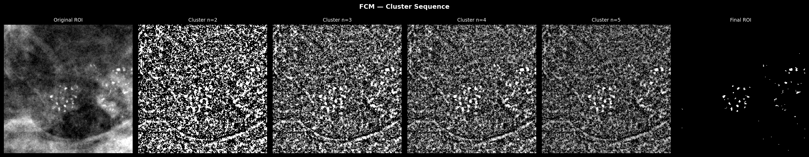
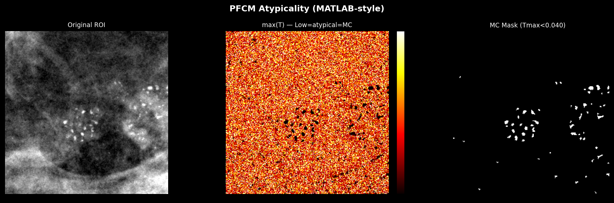
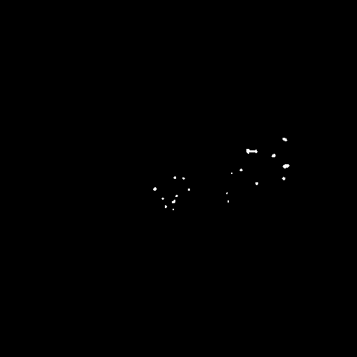

# Medical Image Standard Library

A standardized Python framework for medical image processing with GPU acceleration, built on PyTorch tensors. Provides abstract interfaces, extensible algorithm pipelines, and automatic device management for DICOM and other medical image formats.

A demo is available [Here.](https://latismedical.streamlit.app/)

---

## Purpose

Provide **standardized abstractions** for medical image processing workflows:

- **Abstract base classes** defining core interfaces (`Image`, `Algorithm`)
- **Lazy loading pattern** for memory-efficient image handling
- **Static processing methods** for filters, thresholding, morphology, and metrics
- **Extensible algorithm framework** using lambda composition
- **Patch-based processing** for large images
- **GPU acceleration** via PyTorch with automatic device inference, OOM fallback, mixed precision, and batch processing

---

## Architecture Overview

### Core Design Principles

1. **Abstraction-First**: Define interfaces through abstract base classes
2. **Lazy Loading**: `__init__()` stores metadata, `load()` loads data
3. **Static Methods**: Stateless processing operations
4. **Composition**: Build algorithms from lambda functions
5. **Device-Aware**: Processing follows the image's device automatically
6. **Extensibility**: Easy to add formats, algorithms, and operations

### Package Structure

```
medical_image/
├── data/                # Image ABC, DicomImage, PNGImage, InMemoryImage, Patch, ROI
├── datasets/            # BaseDataset ABC, INbreastDataset, CustomINbreastDataset, CBISDDSMDataset
├── process/             # Filters, Threshold, Morphology, Metrics, Frequency
├── algorithms/          # Algorithm ABC, FEBDS, FCM, PFCM, KMeans, TopHat, BreastMask, DicomWindow
└── utils/               # device (GPU), logging, annotations, pairing, mask_utils, downloader
```

### Design Patterns

- **Strategy & Template (Algorithms):** Algorithms inherit from `Algorithm` ABC, define steps as lambdas in `__init__`, and execute via the `apply()` template method. Strategies like FEBDS, FCM, KMeans are swappable.
- **Lazy Loading (Data):** Image classes store file paths on creation; `.load()` defers I/O until needed.
- **Static Factories (Processing):** `Filters`, `Threshold`, `MorphologyOperations` operate statelessly on Image inputs.
- **Device Flow (GPU):** All processing methods infer the device from input images by default. Explicit `device=` overrides are still supported.

---

## Installation

### Requirements
- Python 3.11+
- Linux OS
- CUDA GPU (optional, for GPU acceleration)

### Option A — Using `venv`

```bash
git clone https://github.com/LATIS-DocumentAI-Group/medical-image-std.git
cd medical-image-std

python -m venv .venv
source .venv/bin/activate
pip install -e .
```

### Option B — Using `uv` (Astral)

```bash
git clone https://github.com/LATIS-DocumentAI-Group/medical-image-std.git
cd medical-image-std

uv venv
source .venv/bin/activate
uv pip install -e .
```

### Optional Dependencies

```bash
# Development tools (pytest, black, ruff, mypy)
pip install -e ".[dev]"

# GPU support (requires CUDA-compatible GPU and drivers)
pip install -e ".[gpu]"

# Everything
pip install -e ".[all]"
```

### GPU Requirements

GPU acceleration requires:
- NVIDIA GPU with CUDA support
- CUDA toolkit installed (12.x recommended)
- PyTorch with CUDA backend (`torch.cuda.is_available()` should return `True`)

Without a GPU, all operations run on CPU automatically.

---

## Quick Start

### 1. Load Image (Lazy Loading)

```python
from medical_image import DicomImage

# Create object (no data loaded yet)
image = DicomImage("mammogram.dcm")
image.load()  # Lazy loading

image.display_info()
```

### 2. Apply Processing

```python
from medical_image import Filters, Threshold

output = image.clone()

# device is inferred from image automatically (no device= needed)
Filters.gaussian_filter(image, output, sigma=2.0)
Threshold.otsu_threshold(output, output)
```

### 3. Use Algorithms

```python
from medical_image import FebdsAlgorithm

algo = FebdsAlgorithm(method="dog")
output = image.clone()
algo(image, output)  # __call__ returns output
```

### 4. Visualize Results

```python
import matplotlib.pyplot as plt

fig, axes = plt.subplots(1, 2, figsize=(10, 5))

axes[0].imshow(image.pixel_data.cpu().numpy(), cmap="gray")
axes[0].set_title("Original")

axes[1].imshow(output.pixel_data.cpu().numpy(), cmap="gray")
axes[1].set_title("FEBDS Output")

for ax in axes:
    ax.axis("off")
plt.tight_layout()
plt.show()
```

### 5. Display Image Info

`display_info()` logs metadata via Python's `logging` module. Enable logging to see the output:

```python
import logging
logging.basicConfig(level=logging.INFO)

image.display_info()
# Output:
# === Image Info ===
# File Path: mammogram.dcm
# Pixel Data: Loaded
# Pixel Data Type: torch.float32
# Shape (H x W): torch.Size([4096, 3328])
# Device: cpu
# Width: 3328
# Height: 4096
# Annotations: None
# =================
```

### 6. Patch-based Processing

```python
from medical_image import PatchGrid

patch_grid = PatchGrid(image, patch_size=(256, 256))

for patch in patch_grid.patches:
    p = patch.load()
    # process p.pixel_data
```

---

## GPU Acceleration

### Automatic Device Inference

All processing methods use `device=None` by default. The device is resolved automatically from the input image:

```python
# Move image to GPU once — all operations follow
image.to("cuda")
output = image.clone()

# No device= parameter needed — inferred from image
Filters.gaussian_filter(image, output, sigma=2.0)
Filters.median_filter(output, output, size=5)
Threshold.otsu_threshold(output, output)

# Explicit override still works
Filters.gaussian_filter(image, output, sigma=2.0, device="cpu")
```

The `resolve_device()` helper implements the priority: explicit parameter > image device > CPU fallback.

```python
from medical_image import resolve_device

device = resolve_device(image, explicit=None)  # returns image.pixel_data.device
```

### DeviceContext Manager

Manages GPU memory with automatic cache clearing and OOM fallback:

```python
from medical_image import DeviceContext

with DeviceContext("cuda", verbose=True) as ctx:
    image.to(ctx.device)
    output = image.clone()
    algo = FebdsAlgorithm(method="dog", device=str(ctx.device))
    algo(image, output)
    print(ctx.memory_stats())
# GPU cache automatically cleared on exit
```

If CUDA is not available, `DeviceContext` falls back to CPU automatically.

### OOM Fallback with `@gpu_safe`

The `@gpu_safe` decorator catches CUDA Out-of-Memory errors and retries on CPU:

```python
from medical_image import gpu_safe

@gpu_safe
def my_processing(image, output, device=None):
    Filters.gaussian_filter(image, output, sigma=2.0, device=device)
    return output

# If GPU runs out of memory, automatically retries on CPU
result = my_processing(image, output, device="cuda")
```

### Mixed Precision

Control floating-point precision globally. Medical imaging at 12-bit depth (0-4095) fits within float16 range (max 65504), enabling 2x throughput with half the memory:

```python
from medical_image import Precision, set_default_precision, get_dtype

# Default is float32
set_default_precision(Precision.HALF)      # float16 — 2x faster
set_default_precision(Precision.BFLOAT16)  # bfloat16 — 2x faster, better range
set_default_precision(Precision.FULL)      # float32 — default

# Algorithms use autocast when precision != FULL on GPU
algo = FebdsAlgorithm(method="dog", device="cuda")
algo.precision = Precision.HALF
algo(image, output)  # runs under torch.cuda.amp.autocast
```

### Batch Processing

Process multiple images in a single GPU kernel launch:

```python
import torch
from medical_image import Filters, TopHatAlgorithm, InMemoryImage

# --- Filter-level batching (single GPU kernel) ---
batch = torch.randn(8, 1, 256, 256, device="cuda")
filtered = Filters.gaussian_filter_batch(batch, sigma=2.0)

# --- Algorithm-level batching ---
# Build Image objects from tensors
images = []
outputs = []
for i in range(4):
    img = InMemoryImage.from_array(torch.randn(256, 256))
    img.to("cuda")
    images.append(img)
    outputs.append(img.clone())

algo = TopHatAlgorithm(radius=4, device="cuda")
results = algo.apply_batch(images, outputs)  # loops over apply(); subclasses can override
```

### GPU Memory Clearing

To free GPU memory when you are done processing:

```python
import torch

# Option 1: Manual cache clearing
del output  # remove references to GPU tensors
torch.cuda.empty_cache()  # release cached memory back to CUDA

# Option 2: DeviceContext (automatic)
from medical_image import DeviceContext

with DeviceContext("cuda") as ctx:
    # ... all GPU work here ...
    pass
# GPU cache is automatically cleared when the context exits

# Option 3: Full GPU memory reset (clears everything)
torch.cuda.reset_peak_memory_stats()
torch.cuda.empty_cache()

# Check current GPU memory usage
print(f"Allocated: {torch.cuda.memory_allocated() / 1e6:.1f} MB")
print(f"Cached:    {torch.cuda.memory_reserved() / 1e6:.1f} MB")
```

### Pinned Memory

For faster CPU-to-GPU transfers:

```python
image.pin_memory()  # page-locked memory
image.to("cuda")    # faster transfer
```

### Async GPU Pipeline

Overlap disk I/O and GPU compute using CUDA streams:

```python
from medical_image import AsyncGPUPipeline

pipeline = AsyncGPUPipeline(device="cuda")
results = pipeline.process_images(loaded_images, algorithm)
```

### Multi-GPU Support

Distribute processing across multiple GPUs:

```python
from medical_image import MultiGPUAlgorithm, FebdsAlgorithm

multi = MultiGPUAlgorithm(FebdsAlgorithm, gpu_ids=[0, 1], method="dog")
outputs = multi.apply_batch(images, [img.clone() for img in images])
```

---

## Datasets

Production-grade PyTorch `Dataset` classes with lazy loading, automatic file pairing, and standardized outputs.

### Available Datasets

| Dataset | Class | Description |
|---------|-------|-------------|
| **INbreast** | `INbreastDataset` | Mammography with DICOM + XML annotations, generates binary masks |
| **Custom INbreast** | `CustomINbreastDataset` | INbreast with TIF mask support (TIF > XML > empty priority) |
| **CBIS-DDSM** | `CBISDDSMDataset` | Large-scale mammography with full-image and patch-based modes |

### Quick Example

```python
from medical_image.datasets import CBISDDSMDataset
from torch.utils.data import DataLoader

dataset = CBISDDSMDataset(
    root_dir="/data/ddsm",
    mode="full_image",
    target_size=(1024, 1024),
    percentage=0.1,        # 10% subset for prototyping
)

loader = DataLoader(
    dataset,
    batch_size=4,
    collate_fn=CBISDDSMDataset.collate_fn,
    num_workers=4,
    pin_memory=True,
)

for batch in loader:
    images = batch["image"]       # [B, 1, 1024, 1024]
    masks = batch["mask"]         # [B, 1, 1024, 1024]
    metadata = batch["metadata"]
```

All datasets return dictionaries with `"image"` (Tensor), `"mask"` (Tensor), and `"metadata"` (dict). See the [Dataset Guide](docs/datasets.md) for full documentation.

---

## Algorithms

### Available Algorithms

| Algorithm | Class | Description |
|-----------|-------|-------------|
| **Top-Hat** | `TopHatAlgorithm` | White top-hat transform highlighting bright structures smaller than the SE |
| **K-Means** | `KMeansAlgorithm` | Hard clustering with k-means++, isolates brightest cluster |
| **FCM** | `FCMAlgorithm` | Fuzzy C-Means with soft membership, isolates brightest cluster |
| **PFCM** | `PFCMAlgorithm` | Possibilistic FCM detecting microcalcifications via atypicality |
| **FEBDS** | `FebdsAlgorithm` | Fourier Enhancement + Band-pass filtering with DoG/LoG/FFT modes |
| **Breast Mask** | `BreastMaskAlgorithm` | Automatic breast region segmentation |
| **DICOM Window** | `DicomWindowAlgorithm` | DICOM windowing (window center/width) |
| **Grail Window** | `GrailWindowAlgorithm` | Grail-style DICOM windowing |
| **Bit Depth Norm** | `BitDepthNormAlgorithm` | Bit-depth normalization |

### Custom Algorithm

```python
from medical_image import Algorithm, Filters, Threshold

class MyAlgorithm(Algorithm):
    def __init__(self, device=None):
        super().__init__(device=device)
        self.blur = lambda img, out: Filters.gaussian_filter(img, out, sigma=2.0, device=self.device)
        self.thresh = lambda img, out: Threshold.otsu_threshold(img, out, device=self.device)

    def apply(self, image, output):
        self.blur(image, output)
        self.thresh(output, output)
        return output
```

---

## Processing Modules

### Filters
- `gaussian_filter` — Gaussian blur
- `median_filter` — Median denoising
- `convolution` — Generic 2D convolution
- `difference_of_gaussian` — DoG band-pass filter
- `laplacian_of_gaussian` — LoG edge detection
- `butterworth_kernel` — Frequency-domain band-pass
- `gamma_correction` — Gamma correction
- `contrast_adjust` — Contrast and brightness adjustment
- `gaussian_filter_batch` — Batched Gaussian filter (B, C, H, W)

### Threshold
- `otsu_threshold` — Global Otsu binarization
- `sauvola_threshold` — Adaptive local thresholding
- `binarize` — Local/global variance-based binarization

### Morphology
- `morphology_closing` — Binary closing (dilation + erosion)
- `region_fill` — Binary hole filling
- `erosion` — Grayscale erosion with disk SE
- `dilation` — Grayscale dilation with disk SE
- `white_top_hat` — White top-hat transform

### Metrics
- `entropy` — Shannon entropy
- `joint_entropy` — Joint Shannon entropy
- `mutual_information` — Mutual information between two images
- `local_variance` — Per-region local variance
- `variance` — Global variance

### Frequency
- `fft` — 2D Fast Fourier Transform
- `inverse_fft` — 2D Inverse FFT

---

## Key Concepts

### Lazy Loading Pattern
- **Object Creation**: `image = DicomImage("path.dcm")` — only stores path
- **Data Loading**: `image.load()` — loads pixel data to memory
- **Memory Efficient**: load only when needed, clone lightweight copies

### Image Lifecycle

```python
image = DicomImage("scan.dcm")   # metadata only
image.load()                      # pixel_data loaded as torch.Tensor
image.to("cuda")                  # move to GPU
output = image.clone()            # lightweight clone (no heavy DICOM objects)
output.pin_memory()               # page-lock for fast transfers
```

### Device Flow

All ~30 processing methods follow the same pattern:

```python
def some_filter(image, output, ..., device=None):
    device = resolve_device(image, explicit=device)  # infer from image
    img = image.pixel_data.to(device).float()
    # ... processing ...
    output.pixel_data = result
```

### Logging

The library uses Python's standard `logging` with `NullHandler` (no output by default):

```python
from medical_image.utils.logging import configure_logging

# Enable console + file logging
configure_logging(level=logging.DEBUG, log_file="processing.log")
```

---

## Visual Examples

The following demonstrates all algorithms on a mammogram ROI (`20527054.dcm`, center `cx=1250, cy=2000`, half-size `127`).

### Base Region Of Interest (ROI)



### Algorithm Outputs

#### Top-Hat Transform

Enhances brighter elements matching the disk structural element radius.

#### K-Means Clustering Sequence

Identifies calcifications by hard partitioning pixel frequency and marking the brightest cluster.

#### FCM Clustering Sequence

Similar to K-Means, but assigns fuzzy membership probabilities to elements to better separate border intensities.

#### PFCM Typicality Mapping

Averages across noise using cluster typicality measurements, masking out all "atypical" calcified structures apart from dark backgrounds.

#### FEBDS Output

Uses a hybrid approach of localized difference-of-gaussian (or frequency band-pass) filters and adaptive binarizations.

---

## Testing

```bash
# Run all tests
pytest medical_image/tests/

# Run specific test suites
pytest medical_image/tests/test_dicom.py          # DICOM + processing tests
pytest medical_image/tests/test_mc_algorithms.py   # Algorithm unit tests
pytest medical_image/tests/test_gpu.py             # GPU + device inference tests

# Tests auto-detect CUDA — GPU tests run on both CPU and CUDA when available
# Tests that require CUDA are skipped on CPU-only machines
```

### Test Coverage

| Suite | Tests | What it covers |
|-------|:-----:|----------------|
| `test_dicom.py` | 18 | DICOM loading, filters vs scikit-image, morphology vs scipy, FEBDS pipeline, patches |
| `test_mc_algorithms.py` | 71 | KMeans, FCM, PFCM, TopHat, full pipeline integration, ROI extraction |
| `test_gpu.py` | 47 | Device inference, DeviceContext, Precision, pin_memory, all modules on CPU+CUDA, batch ops |
| **Total** | **136+** | |

---

## Documentation

| Document | Description |
|----------|-------------|
| **[INDEX](docs/INDEX.md)** | Documentation navigation and overview |
| **[Architecture](docs/architecture.md)** | Design patterns, diagrams, workflows |
| **[API Reference](docs/api_reference.md)** | Complete API documentation |
| **[User Guide](docs/user_guide.md)** | Tutorials and examples |
| **[Algorithms](docs/algorithms.md)** | Algorithm theory and implementation |
| **[Datasets](docs/datasets.md)** | CBIS-DDSM and custom datasets |
| **[Contributing](docs/contributing.md)** | Development guide and CI requirements |
| **[Quick Reference](docs/quick_reference.md)** | Code snippets cheat sheet |

---

## Development

### Code Formatting

```bash
black medical_image/
black --check .        # CI check
```

### Adding Features

- **New Image Format**: Extend `Image` ABC, implement `load()` and `save()`
- **New Processing Method**: Add static method to the appropriate class, use `device=None` + `resolve_device()`
- **New Algorithm**: Extend `Algorithm` ABC, implement `apply()`, use lambda composition in `__init__`

---

## Contributing

1. Fork the repository
2. Create feature branch
3. Follow code standards (Black formatting)
4. Write tests following existing structure
5. Ensure CI passes locally: `pytest medical_image/tests/ && black --check .`
6. Submit pull request

---

## License

MIT License - See [LICENSE](LICENSE) file

---

## Links

- **Repository**: https://github.com/LATIS-DocumentAI-Group/medical-image-std
- **Documentation**: [docs/INDEX.md](docs/INDEX.md)

---

## Version

**Current**: 0.4.1