# Algorithm Reference

## Overview

This document provides detailed information about all image processing and segmentation algorithms in the Medical Image Standard Library, including their mathematical foundations, input/output specifications, pipeline flowcharts, and the relationships between them.

---

## Table of Contents

1. [Algorithm Taxonomy](#algorithm-taxonomy)
2. [Algorithm Relationships](#algorithm-relationships)
3. [Segmentation Algorithms](#segmentation-algorithms)
   - [Top-Hat Transform](#top-hat-transform)
   - [K-Means Clustering](#k-means-clustering)
   - [Fuzzy C-Means (FCM)](#fuzzy-c-means-fcm)
   - [Possibilistic Fuzzy C-Means (PFCM)](#possibilistic-fuzzy-c-means-pfcm)
   - [FEBDS Algorithm](#febds-algorithm)
4. [Filtering Algorithms](#filtering-algorithms)
5. [Thresholding Algorithms](#thresholding-algorithms)
6. [Morphological Algorithms](#morphological-algorithms)
7. [Frequency Domain Algorithms](#frequency-domain-algorithms)
8. [Algorithm Selection Guide](#algorithm-selection-guide)
9. [GPU Acceleration](#gpu-acceleration)
10. [References](#references)

---

## Algorithm Taxonomy

All algorithms inherit from the `Algorithm` ABC and share a common interface:

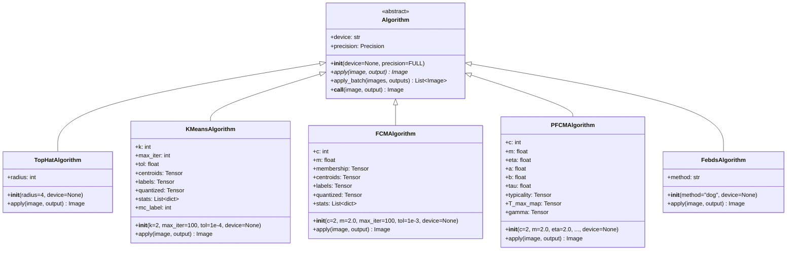

### Input/Output Summary

Every algorithm follows the same calling convention:

| Algorithm | Input | Output | Key Parameters |
|-----------|-------|--------|----------------|
| **TopHat** | 2D float image (e.g. [0,1]) | Float enhancement map | `radius` (SE size) |
| **KMeans** | 2D float image | Binary MC mask (0/1) | `k` (clusters) |
| **FCM** | 2D float image | Binary MC mask (0/1) | `c` (clusters), `m` (fuzziness) |
| **PFCM** | 2D float image | Binary MC mask (0/1) | `c`, `m`, `eta`, `tau` (atypicality threshold) |
| **FEBDS** | 2D float image (12-bit DICOM) | Binary segmentation mask | `method` ("dog", "log", "fft") |

```python
# Common calling pattern for all algorithms:
algo = SomeAlgorithm(params, device="cpu")
output = image.clone()
algo(image, output)  # __call__ returns output
```

---

## Algorithm Relationships

The following diagram shows how the algorithms relate to each other, their shared building blocks, and how they can be composed into pipelines:

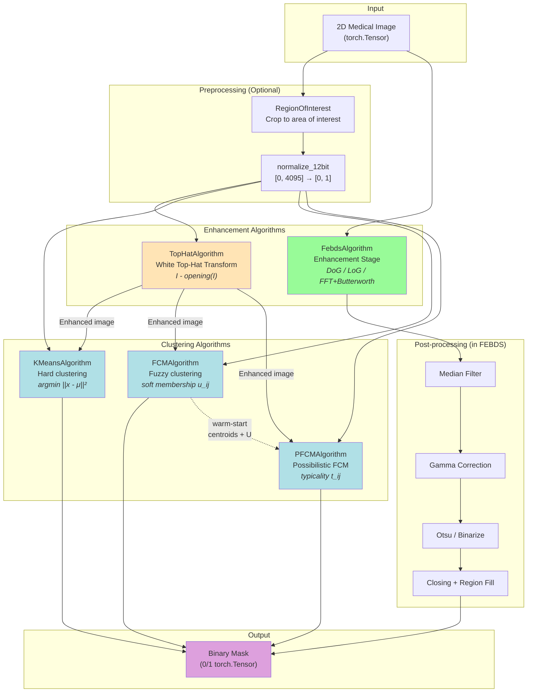

### Key Connections

- **TopHat → Clustering**: TopHat enhances microcalcifications before clustering. The enhanced image is a better input for KMeans/FCM/PFCM.
- **FCM → PFCM**: PFCM warm-starts from FCM. It runs FCM internally first to get initial centroids and memberships, then refines them with typicality.
- **FEBDS is self-contained**: It includes its own enhancement (DoG/LoG/FFT), denoising, thresholding, and morphological post-processing.
- **All clustering algorithms** (KMeans, FCM, PFCM) isolate the **brightest cluster** as the microcalcification mask, except PFCM which uses **atypicality** (low typicality = MC candidate).

### Typical Pipelines

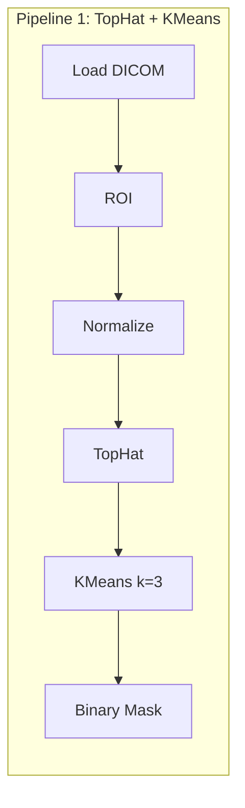

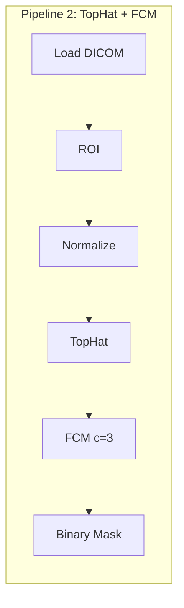

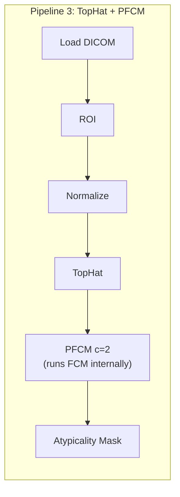

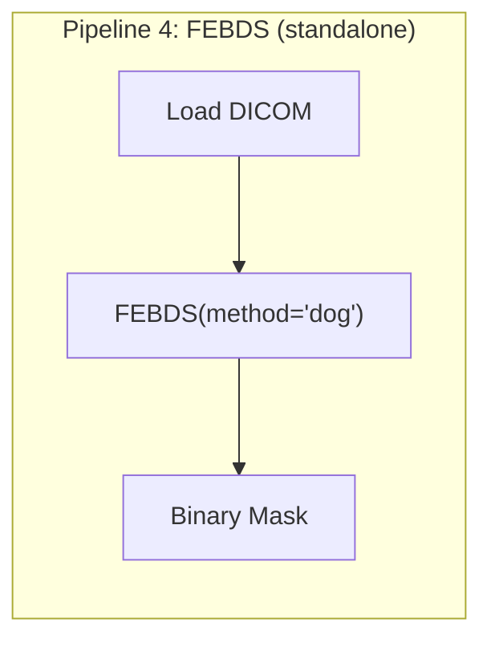

---

## Segmentation Algorithms

### Top-Hat Transform

**Class:** `TopHatAlgorithm`
**Purpose:** Morphological enhancement of small bright structures (microcalcifications) relative to the surrounding background.

**Reference:** Quintanilla-Dominguez et al. (2011)

#### Mathematical Definition

The White Top-Hat Transform computes the residual between the original image and its morphological opening:

```
TopHat(I) = I - opening(I, B)
opening(I, B) = dilation(erosion(I, B), B)
```

Where `I` is the input image and `B` is a flat disk structuring element of the given radius.

#### Flowchart

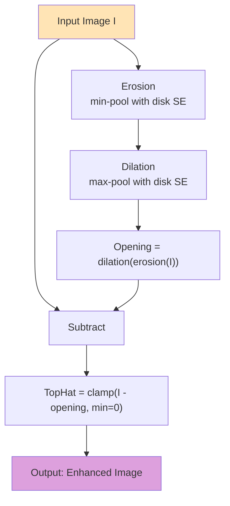

#### Parameters

| Parameter | Type | Default | Description |
|-----------|------|---------|-------------|
| `radius` | int | 4 | Disk SE radius (kernel = 2*radius+1) |
| `device` | str/None | None | Computation device |

#### Usage

```python
from medical_image import TopHatAlgorithm, DicomImage

image = DicomImage.from_array(normalized_array)  # [0, 1] range
output = image.clone()

algo = TopHatAlgorithm(radius=4)
algo(image, output)
# output.pixel_data contains the enhancement map (bright structures highlighted)
```

#### Output Interpretation

- **High values**: Small bright structures (MC candidates) smaller than the SE
- **Near zero**: Background and structures larger than the SE
- TopHat output is typically fed into a clustering algorithm for final segmentation

---

### K-Means Clustering

**Class:** `KMeansAlgorithm`
**Purpose:** Hard partitioning of image pixels into `k` clusters. The brightest cluster is isolated as the microcalcification mask.

#### Mathematical Definition

K-Means minimizes the within-cluster sum of squares:

```
J = Σ_{i=1}^{k} Σ_{x ∈ S_i} ||x - μ_i||²
```

Where `μ_i` is the centroid of cluster `S_i`.

**Initialization:** K-Means++ (distance-proportional random seeding).

#### Flowchart

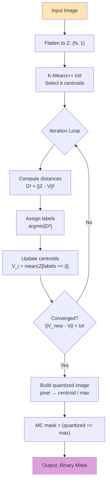

#### Parameters

| Parameter | Type | Default | Description |
|-----------|------|---------|-------------|
| `k` | int | 2 | Number of clusters |
| `max_iter` | int | 100 | Maximum iterations |
| `tol` | float | 1e-4 | Convergence tolerance |
| `random_state` | int | 42 | Random seed |
| `device` | str/None | None | Computation device |

#### Attributes After `apply()`

| Attribute | Shape | Description |
|-----------|-------|-------------|
| `centroids` | (k, 1) | Cluster centroids |
| `labels` | (H, W) | Hard cluster assignments |
| `quantized` | (H, W) | Quantized image (centroid/max) |
| `stats` | List[dict] | Per-cluster statistics |
| `mc_label` | int | Index of brightest cluster |
| `n_iter` | int | Iterations until convergence |
| `converged` | bool | Whether algorithm converged |

#### Usage

```python
from medical_image import KMeansAlgorithm

algo = KMeansAlgorithm(k=3, max_iter=100)
output = image.clone()
algo(image, output)

print(f"Converged in {algo.n_iter} iterations")
print(f"MC cluster: {algo.mc_label}, centroid: {algo.centroids[algo.mc_label, 0]:.1f}")
for s in algo.stats:
    print(f"  Cluster {s['id']}: {s['pixels']} pixels, centroid={s['centroid']:.1f}, is_mc={s['is_mc']}")
```

---

### Fuzzy C-Means (FCM)

**Class:** `FCMAlgorithm`
**Purpose:** Soft partitioning using fuzzy memberships. Each pixel has a degree of belonging to every cluster, enabling better handling of uncertain boundaries.

**Reference:** Quintanilla-Dominguez et al., "Image segmentation by fuzzy and possibilistic clustering algorithms for the identification of microcalcifications" (2011).

#### Mathematical Definition

FCM minimizes the objective function:

```
J_m = Σ_{i=1}^{N} Σ_{j=1}^{c} u_{ij}^m ||x_i - c_j||²
```

Where:
- `u_{ij}` is the membership of pixel `x_i` in cluster `j` (0 ≤ u ≤ 1, Σ_j u_{ij} = 1)
- `c_j` is the centroid of cluster `j`
- `m > 1` is the fuzziness exponent (typically 2.0)

**Membership update:**
```
u_{ij} = 1 / Σ_{k=1}^{c} (d_{ij} / d_{ik})^{2/(m-1)}
```

**Centroid update:**
```
c_j = Σ_i u_{ij}^m * x_i / Σ_i u_{ij}^m
```

#### Flowchart

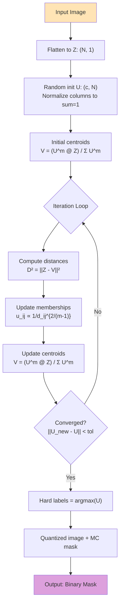

#### Parameters

| Parameter | Type | Default | Description |
|-----------|------|---------|-------------|
| `c` | int | 2 | Number of clusters |
| `m` | float | 2.0 | Fuzziness exponent (m > 1) |
| `max_iter` | int | 100 | Maximum iterations |
| `tol` | float | 1e-3 | Convergence tolerance |
| `random_state` | int | 42 | Random seed |
| `device` | str/None | None | Computation device |

#### Attributes After `apply()`

| Attribute | Shape | Description |
|-----------|-------|-------------|
| `centroids` | (c, 1) | Cluster centroids |
| `membership` | (c, N) | Fuzzy membership matrix U |
| `labels` | (H, W) | Hard cluster assignments (argmax U) |
| `quantized` | (H, W) | Quantized image |
| `stats` | List[dict] | Per-cluster statistics |
| `mc_label` | int | Index of brightest cluster |

#### Usage

```python
from medical_image import FCMAlgorithm

algo = FCMAlgorithm(c=3, m=2.0)
output = image.clone()
algo(image, output)

# Access fuzzy memberships
print(f"Membership shape: {algo.membership.shape}")  # (3, H*W)
```

#### Difference from K-Means

| Aspect | K-Means | FCM |
|--------|---------|-----|
| Assignment | Hard (0 or 1) | Soft (0.0 to 1.0) |
| Boundary pixels | Forced into one cluster | Shared between clusters |
| Noise sensitivity | High | Lower (fuzzy margins) |
| Computation | Faster | Slower (membership matrix) |

---

### Possibilistic Fuzzy C-Means (PFCM)

**Class:** `PFCMAlgorithm`
**Purpose:** Extends FCM with **typicality values** measuring how representative a pixel is for each cluster. Microcalcifications are detected as **atypical** pixels (low maximum typicality).

**Reference:** Quintanilla-Dominguez et al. (2011)

#### Mathematical Definition

PFCM minimizes a combined objective incorporating both fuzzy memberships (`u`) and typicality (`t`):

```
J_PFCM = Σ_i Σ_j (a * u_{ij}^m + b * t_{ij}^η) * ||x_i - c_j||²
         + Σ_j γ_j * Σ_i (1 - t_{ij})^η
```

Where:
- `a, b` balance fuzzy vs. typicality contributions
- `η` controls possibilistic fuzziness
- `γ_j` is the cluster penalty (computed from FCM warm-start)
- `t_{ij}` has **no sum-to-one constraint** (unlike `u_{ij}`)

**Typicality update:**
```
t_{ij} = 1 / (1 + (b * d_{ij}² / γ_j)^{1/(η-1)})
```

**MC detection:** Pixels with `max_j(t_{ij}) < τ` are flagged as atypical (microcalcification candidates).

#### Flowchart

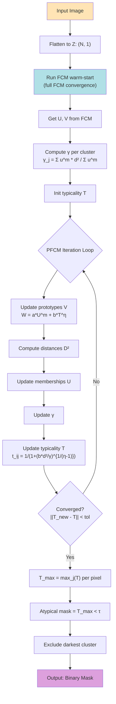

#### FCM → PFCM Warm-Start Connection

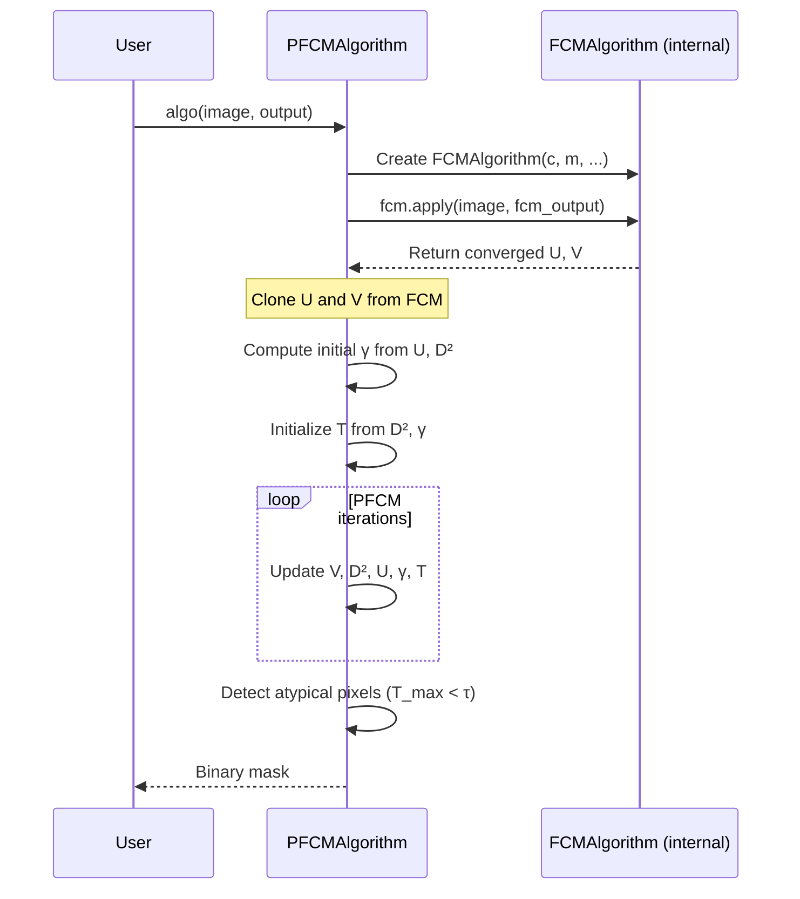

#### Parameters

| Parameter | Type | Default | Description |
|-----------|------|---------|-------------|
| `c` | int | 2 | Number of clusters |
| `m` | float | 2.0 | Fuzziness exponent |
| `eta` | float | 2.0 | Typicality fuzziness |
| `a` | float | 1.0 | Fuzzy weight in prototype update |
| `b` | float | 4.0 | Typicality weight in prototype update |
| `tau` | float | 0.04 | Atypicality threshold |
| `max_iter` | int | 100 | PFCM iterations |
| `tol` | float | 1e-3 | Convergence tolerance |
| `fcm_max_iter` | int | 100 | FCM warm-start iterations |
| `random_state` | int | 42 | Random seed |
| `device` | str/None | None | Computation device |

#### Attributes After `apply()`

| Attribute | Shape | Description |
|-----------|-------|-------------|
| `typicality` | (c, N) | Typicality matrix T |
| `T_max_map` | (H, W) | Max typicality per pixel |
| `centroids` | (c, 1) | Cluster centroids |
| `membership` | (c, N) | Fuzzy membership matrix U |
| `labels` | (H, W) | Hard cluster assignments |
| `quantized` | (H, W) | Quantized image |
| `gamma` | (c,) | Cluster penalty values |

#### Usage

```python
from medical_image import PFCMAlgorithm

algo = PFCMAlgorithm(c=2, tau=0.04)
output = image.clone()
algo(image, output)

print(f"Converged in {algo.n_iter} PFCM iterations")
print(f"Atypical pixels (MCs): {(algo.T_max_map < algo.tau).sum()}")
```

#### How PFCM Differs from FCM

| Aspect | FCM | PFCM |
|--------|-----|------|
| Membership | Fuzzy (sum to 1) | Fuzzy + Typicality (no constraint) |
| MC Detection | Brightest cluster | Atypical pixels (low T_max) |
| Noise Handling | Moderate | Better (typicality absorbs noise) |
| Warm-start | Random init | From converged FCM |
| Computation | Moderate | Higher (FCM + PFCM iterations) |

---

### FEBDS Algorithm

**Class:** `FebdsAlgorithm`
**Purpose:** Frequency-Enhanced Band-pass Detection System for microcalcification segmentation. A complete, self-contained pipeline.

**Reference:** Lopez & Urcid, "Mammograms calcifications segmentation based on band-pass Fourier filtering and adaptive statistical thresholding" (2016).

#### Methods

The algorithm supports three frequency enhancement methods:

##### 1. Difference of Gaussian (DoG)
```
DoG(x, y) = G(x, y, σ₁) - G(x, y, σ₂)
```
Default: σ₁ = 1.7, σ₂ = 2.0. Fast, spatial domain.

##### 2. Laplacian of Gaussian (LoG)
```
LoG(x, y) = ∇²[G(x, y, σ)]
```
Default: σ = 2.0. Blob detection, spatial domain.

##### 3. FFT + Butterworth Band-pass
```
H(u,v) = 1 / [1 + ((D²-D₀²) / (8·W·D))^(2n)]
```
Default: D₀ = 21, W = 32, n = 3. Frequency domain.

#### Complete Pipeline Flowchart

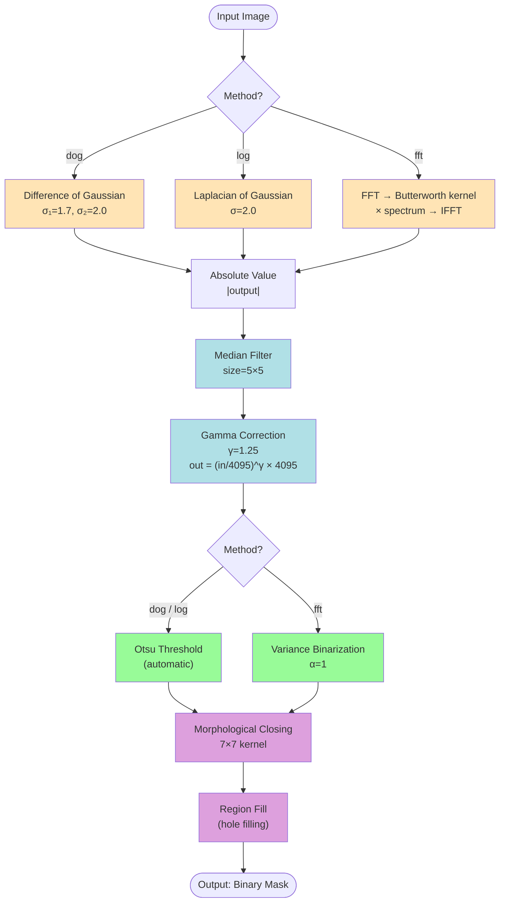

#### Parameters

| Parameter | Type | Default | Description |
|-----------|------|---------|-------------|
| `method` | str | — | Enhancement method: "dog", "log", or "fft" |
| `device` | str/None | None | Computation device |

#### Performance Comparison

| Method | Speed | Accuracy | Best For |
|--------|:-----:|:--------:|----------|
| DoG | Fast | Good | General purpose, quick screening |
| LoG | Medium | Very Good | Precise blob detection |
| FFT | Slow | Excellent | High-quality segmentation, research |

#### Usage

```python
from medical_image import FebdsAlgorithm, DicomImage

mammogram = DicomImage("mammogram.dcm")
mammogram.load()

# Compare all three methods
for method in ["dog", "log", "fft"]:
    output = mammogram.clone()
    algo = FebdsAlgorithm(method=method)
    algo(mammogram, output)
    positive = (output.pixel_data > 0).sum().item()
    print(f"FEBDS({method}): {positive} positive pixels")
```

---

## Filtering Algorithms

All filters are static methods on `Filters`. Device is inferred from the input image by default (`device=None`).

### Gaussian Filter

**Purpose:** Smooth images and reduce noise.

```
G(x, y) = (1/(2πσ²)) * exp(-(x² + y²)/(2σ²))
```

```python
Filters.gaussian_filter(image, output, sigma=2.0)
# Batch variant:
filtered_batch = Filters.gaussian_filter_batch(batch_tensor, sigma=2.0)
```

| Parameter | Type | Description |
|-----------|------|-------------|
| `sigma` | float | Standard deviation (controls blur) |
| `truncate` | float | Kernel truncation factor (default 4.0) |

### Median Filter

**Purpose:** Remove salt-and-pepper noise while preserving edges.

```python
Filters.median_filter(image, output, size=5)
```

| Parameter | Type | Description |
|-----------|------|-------------|
| `size` | int | Window size (must be odd) |

### Difference of Gaussian (DoG)

**Purpose:** Band-pass filter for edge and blob detection.

```python
Filters.difference_of_gaussian(image, output, low_sigma=1.0, high_sigma=1.6)
```

### Laplacian of Gaussian (LoG)

**Purpose:** Blob detection and edge enhancement using second derivative.

```python
Filters.laplacian_of_gaussian(image, output, sigma=2.0)
```

### Butterworth Kernel

**Purpose:** Frequency-domain band-pass filter.

```python
Filters.butterworth_kernel(image, output, D_0=21, W=32, n=3)
```

### Gamma Correction

```
output = (input / 4095)^γ × 4095
```

```python
Filters.gamma_correction(image, output, gamma=1.25)
```

### Contrast Adjustment

```
output = α × input + β
α = contrast / (bins/2) + 1, β = brightness - contrast
```

```python
Filters.contrast_adjust(image, output, contrast=50, brightness=30)
```

---

## Thresholding Algorithms

### Otsu's Method

**Purpose:** Automatic global thresholding by maximizing between-class variance.

```
σ²_between = w₀ × w₁ × (μ₀ - μ₁)²
```

```python
Threshold.otsu_threshold(image, output)
```

No parameters needed (fully automatic). Supports 8-bit and 12-bit images.

### Sauvola's Method

**Purpose:** Local adaptive thresholding for varying illumination.

```
T(x, y) = m(x, y) × [1 + k × (s(x, y)/R - 1)]
```

```python
Threshold.sauvola_threshold(image, output, window_size=15, k=0.5, r=128)
```

### Variance-based Binarization

**Purpose:** Threshold using local vs. global variance ratio.

```
Binary(x, y) = 1 if σ²_local(x, y) ≥ α × σ²_global
```

```python
Threshold.binarize(image, output, alpha=1.0)
```

---

## Morphological Algorithms

### Morphological Closing

**Purpose:** Fill small holes and smooth contours. Closing = dilation followed by erosion.

```python
MorphologyOperations.morphology_closing(image, output, kernel_size=7)
```

### Region Filling

**Purpose:** Fill holes in binary regions using iterative dilation with boundary constraints.

```python
MorphologyOperations.region_fill(image, output)
```

### Erosion / Dilation

Grayscale erosion and dilation using min/max pooling with flat disk SE.

```python
MorphologyOperations.erosion(image, output, radius=4)
MorphologyOperations.dilation(image, output, radius=4)
```

### White Top-Hat

**Purpose:** `TopHat(I) = I - opening(I, B)`. Available as both a standalone static method and the `TopHatAlgorithm` class.

```python
MorphologyOperations.white_top_hat(image, output, radius=4)
```

---

## Frequency Domain Algorithms

### Fast Fourier Transform

```python
FrequencyOperations.fft(image, output)      # spatial → frequency
FrequencyOperations.inverse_fft(image, output)  # frequency → spatial
```

Used internally by FEBDS (method="fft") with Butterworth band-pass filtering.

---

## Algorithm Selection Guide

### For Microcalcification Detection

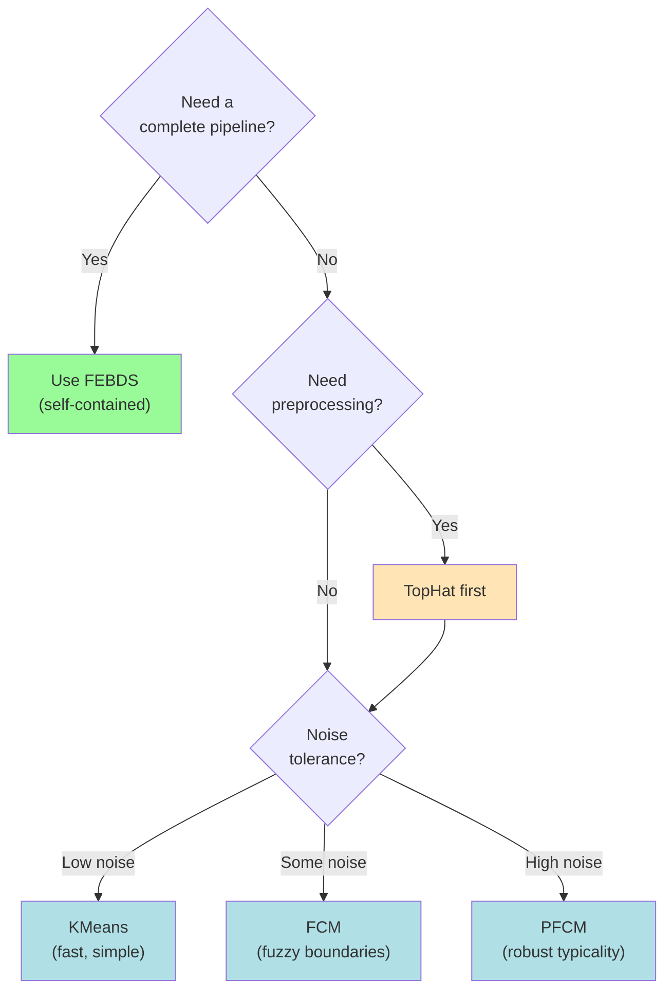

### Quick Decision Table

| Scenario | Recommended | Why |
|----------|-------------|-----|
| Quick screening, unknown image | FEBDS (DoG) | Self-contained, fast |
| High-quality research | FEBDS (FFT) | Best frequency selectivity |
| Pre-enhanced image (TopHat done) | KMeans k=3 | Fast, hard boundaries |
| Uncertain boundaries | FCM c=3 | Soft membership handles edges |
| Noisy image, robust detection | PFCM c=2 | Atypicality resists noise |
| Real-time processing | TopHat + KMeans | Fastest pipeline |

### For General Image Processing

| Task | Algorithm |
|------|-----------|
| Noise reduction (impulse) | Median filter |
| Noise reduction (Gaussian) | Gaussian filter |
| Edge detection | DoG or LoG |
| Periodic noise removal | FFT + Butterworth |
| Bimodal segmentation | Otsu threshold |
| Uneven illumination | Sauvola threshold |
| Hole filling | Morphological closing + region fill |

---

## GPU Acceleration

All algorithms and processing methods support automatic device inference:

```python
# Move image to GPU — all operations follow automatically
image.to("cuda")
output = image.clone()

# No device= needed — inferred from image
algo = TopHatAlgorithm(radius=4)
algo(image, output)  # runs on GPU

# Explicit override
Filters.gaussian_filter(image, output, sigma=2.0, device="cpu")
```

### Mixed Precision

```python
from medical_image import Precision

algo = FebdsAlgorithm(method="dog")
algo.precision = Precision.HALF  # float16 — 2x throughput
algo(image, output)  # uses torch.cuda.amp.autocast
```

### Batch Processing

```python
# Algorithm-level batching
algo = KMeansAlgorithm(k=3)
results = algo.apply_batch(images, outputs)

# Filter-level batching (single GPU kernel)
batch = torch.randn(8, 1, 256, 256, device="cuda")
filtered = Filters.gaussian_filter_batch(batch, sigma=2.0)
```

### Memory Management

```python
from medical_image import DeviceContext

with DeviceContext("cuda", verbose=True) as ctx:
    image.to(ctx.device)
    output = image.clone()
    algo = FebdsAlgorithm(method="dog", device=str(ctx.device))
    algo(image, output)
    print(ctx.memory_stats())
# GPU cache cleared automatically
```

---

## References

1. **FEBDS Algorithm:**
   Lopez, E. & Urcid, G. (2016). "Mammograms calcifications segmentation based on band-pass Fourier filtering and adaptive statistical thresholding." *Scientia Iranica*, 5.

2. **FCM / PFCM Algorithms:**
   Quintanilla-Dominguez, J. et al. (2011). "Image segmentation by fuzzy and possibilistic clustering algorithms for the identification of microcalcifications." *Scientia Iranica*, 18(3), 580-589.

3. **Otsu's Method:**
   Otsu, N. (1979). "A threshold selection method from gray-level histograms." *IEEE Trans. Systems, Man, and Cybernetics*, 9(1), 62-66.

4. **Butterworth Filter:**
   Butterworth, S. (1930). "On the Theory of Filter Amplifiers." *Wireless Engineer*, 7, 536-541.