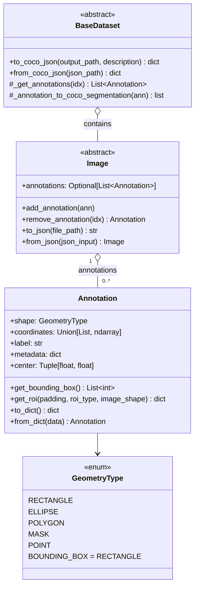
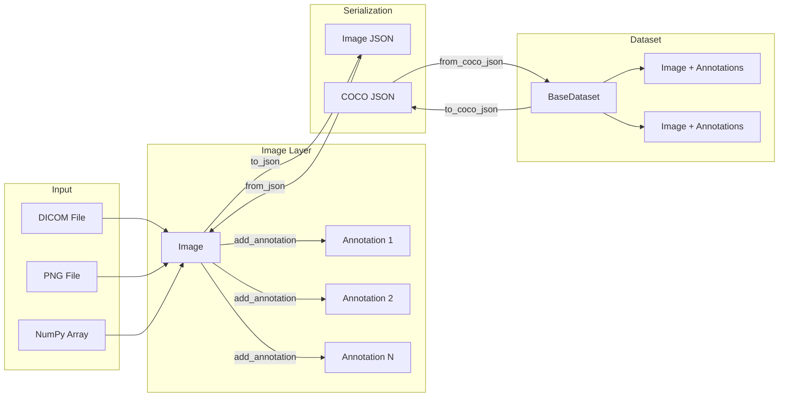
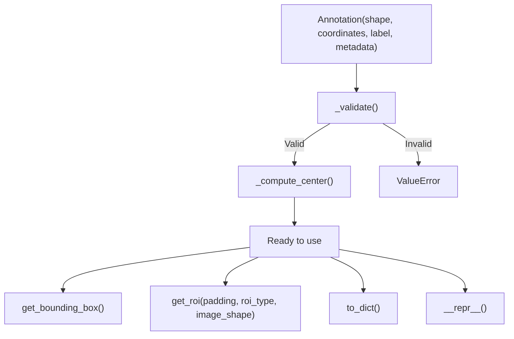

# Annotation & COCO Export API Reference

> **Version:** 0.5.0
> **Last Updated:** 2026-04-15
> **Base Package:** `medical-image-std`
> **License:** MIT

A complete API reference for the annotation system, image-annotation integration, and COCO JSON export/import. This document follows a Swagger-style layout: every endpoint (method) lists its signature, parameters, return type, response schema, and runnable examples.

---

## Table of Contents

1. [Installation](#1-installation)
2. [Quick Start](#2-quick-start)
3. [API Overview](#3-api-overview)
4. [GeometryType Enum](#4-geometrytype-enum)
5. [Annotation](#5-annotation)
   - [Constructor](#51-constructor)
   - [Properties](#52-properties)
   - [get_bounding_box](#53-get_bounding_box)
   - [get_roi](#54-get_roi)
   - [to_dict](#55-to_dict)
   - [from_dict](#56-from_dict)
6. [Image -- Annotation Integration](#6-image--annotation-integration)
   - [annotations field](#61-annotations-field)
   - [add_annotation](#62-add_annotation)
   - [remove_annotation](#63-remove_annotation)
   - [to_json](#64-to_json)
   - [from_json](#65-from_json)
   - [image_from_json (factory)](#66-image_from_json-factory)
7. [BaseDataset -- COCO Export / Import](#7-basedataset--coco-export--import)
   - [to_coco_json](#71-to_coco_json)
   - [from_coco_json](#72-from_coco_json)
   - [_get_annotations](#73-_get_annotations)
   - [_annotation_to_coco_segmentation](#74-_annotation_to_coco_segmentation)
8. [COCO JSON Schema](#8-coco-json-schema)
9. [Usage Examples with Visualizations](#9-usage-examples-with-visualizations)
10. [Architecture Diagram](#10-architecture-diagram)

---

## 1. Installation

### Requirements

- Python >= 3.11
- PyTorch >= 2.0
- NumPy >= 1.26

### Install with uv (recommended)

```bash
# Clone the repository
git clone https://github.com/LATIS-DocumentAI-Group/medical-image-std.git
cd medical-image-std

# Create venv and install with uv
uv venv
uv pip install -e .

# Install with dev dependencies (pytest, black, ruff, mypy)
uv pip install -e ".[dev]"
```

### Install with pip

```bash
pip install -e .

# Or with dev dependencies
pip install -e ".[dev]"
```

### Verify Installation

```python
from medical_image.utils.annotation import Annotation, GeometryType
from medical_image.data.image import image_from_json
from medical_image.datasets.base_dataset import BaseDataset

print("Annotation API ready!")
```

### Run Tests

```bash
# Run all tests
uv run pytest medical_image/tests/ -v

# Run only annotation tests
uv run pytest medical_image/tests/test_annotation.py -v

# Run only COCO export tests
uv run pytest medical_image/tests/test_coco_export.py -v
```

---

## 2. Quick Start

```python
from medical_image.utils.annotation import Annotation, GeometryType
from medical_image.data.in_memory_image import InMemoryImage
import numpy as np

# 1. Create an image
image = InMemoryImage.from_array(np.random.rand(512, 512).astype(np.float32))

# 2. Create annotations
mass = Annotation(
    shape=GeometryType.RECTANGLE,
    coordinates=[100, 150, 200, 250],
    label="mass",
    metadata={"birads": 4},
)

calcification = Annotation(
    shape=GeometryType.POLYGON,
    coordinates=[(300, 100), (320, 90), (340, 110), (330, 130), (310, 125)],
    label="microcalcification",
)

# 3. Attach annotations to image
image.add_annotation(mass)
image.add_annotation(calcification)

# 4. Inspect
print(mass.center)           # (150.0, 200.0)
print(mass.get_bounding_box())  # [100, 150, 200, 250]

# 5. Serialize to JSON
json_str = image.to_json()
restored = InMemoryImage.from_json(json_str)
print(len(restored.annotations))  # 2
```

---

## 3. API Overview



---

## 4. GeometryType Enum

**Module:** `medical_image.utils.annotation`

Defines the supported geometric shapes for annotations.

| Member | Value | Coordinate Format | Description |
|--------|-------|-------------------|-------------|
| `RECTANGLE` | 1 | `[x_min, y_min, x_max, y_max]` | Axis-aligned bounding box |
| `ELLIPSE` | 2 | `[cx, cy, rx, ry]` | Center + radii |
| `POLYGON` | 3 | `[(x1,y1), (x2,y2), ...]` | Ordered vertex list (>= 3 points) |
| `MASK` | 4 | `np.ndarray` (2D) | Binary mask |
| `POINT` | 5 | `[x, y]` | Single point |
| `BOUNDING_BOX` | alias | Same as `RECTANGLE` | Backward-compatible alias |

```python
from medical_image.utils.annotation import GeometryType

# BOUNDING_BOX is an alias for RECTANGLE
assert GeometryType.BOUNDING_BOX is GeometryType.RECTANGLE
```

---

## 5. Annotation

**Module:** `medical_image.utils.annotation`
**Class:** `Annotation`

Represents a single annotation (lesion, region, landmark) on a medical image.

---

### 5.1 Constructor

```python
Annotation(
    shape: GeometryType,
    coordinates: Union[List[int], List[Tuple[int, int]], np.ndarray],
    label: str,
    metadata: Optional[dict] = None,
)
```

| Parameter | Type | Required | Description |
|-----------|------|----------|-------------|
| `shape` | `GeometryType` | Yes | Geometry type of the annotation |
| `coordinates` | `Union[List[int], List[Tuple[int,int]], np.ndarray]` | Yes | Shape-specific coordinate data (see [GeometryType table](#4-geometrytype-enum)) |
| `label` | `str` | Yes | Annotation label (e.g. `"mass"`, `"calcification"`) |
| `metadata` | `Optional[dict]` | No | Extra info (BI-RADS, margins, pathology, etc.). Defaults to `{}` |

**Raises:**
- `ValueError` -- If coordinates do not match the shape contract

**Side Effects:**
- `self.center` is computed automatically from the coordinates

**Example:**

```python
# Rectangle
ann = Annotation(GeometryType.RECTANGLE, [10, 20, 110, 120], "mass")

# Ellipse
ann = Annotation(GeometryType.ELLIPSE, [256.0, 256.0, 50.0, 30.0], "lesion")

# Polygon
ann = Annotation(
    GeometryType.POLYGON,
    [(100, 100), (150, 80), (200, 110), (180, 160), (110, 150)],
    "microcalcification",
    metadata={"birads": 3, "pathology": "benign"},
)
```

---

### 5.2 Properties

| Property | Type | Computed | Description |
|----------|------|----------|-------------|
| `shape` | `GeometryType` | No | The geometry type |
| `coordinates` | `Union[List, np.ndarray]` | No | Raw coordinate data |
| `label` | `str` | No | Annotation label |
| `metadata` | `dict` | No | Extra metadata dictionary |
| `center` | `Tuple[float, float]` | Yes (in constructor) | Centroid `(cx, cy)` of the geometry |

**Center computation rules:**

| Shape | Formula |
|-------|---------|
| `RECTANGLE` | `((x_min + x_max) / 2, (y_min + y_max) / 2)` |
| `ELLIPSE` | `(cx, cy)` (directly from coordinates) |
| `POLYGON` | Arithmetic mean of all vertices |

```python
ann = Annotation(GeometryType.RECTANGLE, [100, 200, 300, 400], "mass")
print(ann.center)  # (200.0, 300.0)
```

---

### 5.3 get_bounding_box

```python
def get_bounding_box(self) -> List[int]
```

Returns the axis-aligned bounding box enclosing the annotation.

**Parameters:** None

**Returns:**

| Type | Format | Description |
|------|--------|-------------|
| `List[int]` | `[x_min, y_min, x_max, y_max]` | Bounding box in pixel coordinates |

**Behavior per shape:**

| Shape | Behavior |
|-------|----------|
| `RECTANGLE` | Returns coordinates as-is |
| `ELLIPSE` | Computes `[cx-rx, cy-ry, cx+rx, cy+ry]` |
| `POLYGON` | Computes min/max of all vertex x and y values |

**Raises:**
- `ValueError` -- For unsupported shapes (e.g. `MASK` without polygon conversion)

**Example:**

```python
ann = Annotation(GeometryType.ELLIPSE, [200.0, 300.0, 50.0, 30.0], "lesion")
bbox = ann.get_bounding_box()
print(bbox)  # [150, 270, 250, 330]
```

---

### 5.4 get_roi

```python
def get_roi(
    self,
    padding: int = 0,
    roi_type: str = "bbox",
    image_shape: Optional[Tuple[int, int]] = None,
) -> dict
```

Returns a region of interest around the annotation, with configurable padding and output shape.

**Parameters:**

| Parameter | Type | Default | Description |
|-----------|------|---------|-------------|
| `padding` | `int` | `0` | Extra pixels added on each side of the bounding box |
| `roi_type` | `str` | `"bbox"` | Output shape: `"bbox"`, `"rectangle"`, or `"ellipse"` |
| `image_shape` | `Optional[Tuple[int, int]]` | `None` | `(height, width)` to clamp ROI within image bounds |

**Returns:**

| roi_type | Return Schema |
|----------|---------------|
| `"bbox"` or `"rectangle"` | `{"type": str, "coordinates": [x_min, y_min, x_max, y_max]}` |
| `"ellipse"` | `{"type": "ellipse", "coordinates": {"center": (cx, cy), "radii": (rx, ry)}}` |

**Raises:**
- `ValueError` -- If `roi_type` is not one of `"bbox"`, `"rectangle"`, `"ellipse"`

**Example:**

```python
ann = Annotation(GeometryType.RECTANGLE, [100, 100, 200, 200], "mass")

# Basic ROI (same as bounding box)
roi = ann.get_roi()
# {"type": "bbox", "coordinates": [100, 100, 200, 200]}

# Padded ROI
roi = ann.get_roi(padding=20)
# {"type": "bbox", "coordinates": [80, 80, 220, 220]}

# Padded + clamped to image bounds
roi = ann.get_roi(padding=20, image_shape=(210, 210))
# {"type": "bbox", "coordinates": [80, 80, 210, 210]}

# Ellipse ROI
roi = ann.get_roi(padding=10, roi_type="ellipse")
# {"type": "ellipse", "coordinates": {"center": (150.0, 150.0), "radii": (60.0, 60.0)}}
```

---

### 5.5 to_dict

```python
def to_dict(self) -> dict
```

Serializes the annotation to a JSON-compatible dictionary.

**Parameters:** None

**Returns:**

```json
{
    "shape": "RECTANGLE",
    "coordinates": [100, 150, 200, 250],
    "label": "mass",
    "center": [150.0, 200.0],
    "bounding_box": [100, 150, 200, 250],
    "metadata": {"birads": 4}
}
```

| Field | Type | Description |
|-------|------|-------------|
| `shape` | `str` | Enum member name (e.g. `"RECTANGLE"`, `"POLYGON"`) |
| `coordinates` | `list` | Shape-specific coordinates. Polygon tuples become nested lists. |
| `label` | `str` | Annotation label |
| `center` | `[float, float]` | Computed centroid |
| `bounding_box` | `[int, int, int, int]` | Enclosing bounding box |
| `metadata` | `dict` | Metadata dictionary |

---

### 5.6 from_dict

```python
@classmethod
def from_dict(cls, data: dict) -> Annotation
```

Deserializes an `Annotation` from a dictionary (inverse of `to_dict`).

**Parameters:**

| Parameter | Type | Required | Description |
|-----------|------|----------|-------------|
| `data` | `dict` | Yes | Dictionary with keys `shape`, `coordinates`, `label`, and optionally `metadata` |

**Returns:** `Annotation`

**Notes:**
- `center` and `bounding_box` fields in the dict are ignored (recomputed from coordinates)
- Polygon coordinates are converted from `[[x,y], ...]` back to `[(x,y), ...]`

**Example:**

```python
d = {
    "shape": "POLYGON",
    "coordinates": [[10, 20], [30, 20], [30, 40], [10, 40]],
    "label": "region",
    "metadata": {},
}
ann = Annotation.from_dict(d)
print(ann.shape)   # GeometryType.POLYGON
print(ann.center)  # (20.0, 30.0)
```

---

## 6. Image -- Annotation Integration

**Module:** `medical_image.data.image`
**Class:** `Image` (abstract), applied to `DicomImage`, `PNGImage`, `InMemoryImage`

The `Image` class holds an optional list of `Annotation` objects via **aggregation** (an image can exist without annotations).

---

### 6.1 annotations field

```python
self.annotations: Optional[List[Annotation]] = None
```

| State | Meaning |
|-------|---------|
| `None` | No annotations have been set |
| `[]` | Annotations were initialized but the list is empty |
| `[Annotation, ...]` | One or more annotations attached |

**Behavior in constructors:**

| Constructor | Annotations behavior |
|-------------|---------------------|
| `from_file(path)` | `None` |
| `from_array(array)` | `None` |
| `from_image(source)` | Copied from source (shared reference) |
| `clone()` | Shallow copy of the list (new list, same Annotation objects) |

---

### 6.2 add_annotation

```python
def add_annotation(self, annotation: Annotation) -> None
```

Appends an annotation to the image. Initializes the list if it is `None`.

**Parameters:**

| Parameter | Type | Required | Description |
|-----------|------|----------|-------------|
| `annotation` | `Annotation` | Yes | The annotation to attach |

**Returns:** `None`

**Example:**

```python
image = InMemoryImage(width=512, height=512)
ann = Annotation(GeometryType.RECTANGLE, [10, 20, 100, 120], "mass")
image.add_annotation(ann)
print(len(image.annotations))  # 1
```

---

### 6.3 remove_annotation

```python
def remove_annotation(self, index: int) -> Annotation
```

Removes and returns the annotation at the given index.

**Parameters:**

| Parameter | Type | Required | Description |
|-----------|------|----------|-------------|
| `index` | `int` | Yes | Zero-based index of the annotation to remove |

**Returns:** `Annotation` -- The removed annotation

**Raises:**
- `IndexError` -- If `annotations` is `None` or `index` is out of range

---

### 6.4 to_json

```python
def to_json(self, file_path: Optional[str] = None) -> str
```

Serializes the image metadata and all annotations to a JSON string.

**Parameters:**

| Parameter | Type | Default | Description |
|-----------|------|---------|-------------|
| `file_path` | `Optional[str]` | `None` | If provided, also writes JSON to this file |

**Returns:** `str` -- JSON string

**Response Schema:**

```json
{
    "file_path": "/path/to/image.dcm",
    "width": 2560,
    "height": 3328,
    "image_type": "DicomImage",
    "annotations": [
        {
            "shape": "RECTANGLE",
            "coordinates": [100, 150, 200, 250],
            "label": "mass",
            "center": [150.0, 200.0],
            "bounding_box": [100, 150, 200, 250],
            "metadata": {}
        }
    ]
}
```

**Example:**

```python
image = InMemoryImage(width=512, height=512)
image.add_annotation(Annotation(GeometryType.RECTANGLE, [10, 20, 30, 40], "mass"))

# Get JSON string
json_str = image.to_json()

# Write to file
image.to_json(file_path="output/image_annotations.json")
```

---

### 6.5 from_json

```python
@classmethod
def from_json(cls, json_input: str) -> Image
```

Deserializes an `Image` from a JSON string or file path. Call on a concrete subclass (`InMemoryImage`, `DicomImage`, `PNGImage`).

**Parameters:**

| Parameter | Type | Required | Description |
|-----------|------|----------|-------------|
| `json_input` | `str` | Yes | JSON string **or** path to a `.json` file |

**Returns:** `Image` -- A new image instance with annotations loaded

**Notes:**
- Pixel data is **not** loaded (lazy). Only metadata and annotations are restored.
- If the original `file_path` no longer exists, it is set to `None`.

**Example:**

```python
# From string
restored = InMemoryImage.from_json(json_str)

# From file
restored = InMemoryImage.from_json("output/image_annotations.json")
print(restored.annotations[0].label)  # "mass"
```

---

### 6.6 image_from_json (factory)

```python
def image_from_json(json_input: str) -> Image
```

**Module-level function** in `medical_image.data.image`.

Reads the `image_type` field from the JSON and dispatches to the correct subclass's `from_json`.

**Parameters:**

| Parameter | Type | Required | Description |
|-----------|------|----------|-------------|
| `json_input` | `str` | Yes | JSON string **or** path to a `.json` file |

**Returns:** `Image` -- Instance of the correct concrete subclass

**Dispatch table:**

| `image_type` value | Class |
|--------------------|-------|
| `"DicomImage"` | `DicomImage` |
| `"PNGImage"` | `PNGImage` |
| `"InMemoryImage"` | `InMemoryImage` |
| _(anything else)_ | `InMemoryImage` (fallback) |

**Example:**

```python
from medical_image.data.image import image_from_json

img = image_from_json("output/image_annotations.json")
print(type(img).__name__)  # "DicomImage" or "InMemoryImage" etc.
```

---

## 7. BaseDataset -- COCO Export / Import

**Module:** `medical_image.datasets.base_dataset`
**Class:** `BaseDataset`

Methods for exporting a full dataset to COCO JSON format and loading it back.

---

### 7.1 to_coco_json

```python
def to_coco_json(
    self,
    output_path: Optional[str] = None,
    description: str = "Medical Image Dataset",
) -> dict
```

Exports the entire dataset (all images + their annotations) as a COCO-format JSON.

**Parameters:**

| Parameter | Type | Default | Description |
|-----------|------|---------|-------------|
| `output_path` | `Optional[str]` | `None` | If provided, writes JSON to this file path |
| `description` | `str` | `"Medical Image Dataset"` | Description in the COCO `info` block |

**Returns:** `dict` -- The full COCO JSON structure (see [Section 8](#8-coco-json-schema))

**Notes:**
- Calls `_get_annotations(idx)` for each sample to collect annotations
- COCO `bbox` format is `[x, y, width, height]` (converted from internal `[x_min, y_min, x_max, y_max]`)
- The `center` field on each annotation is a **custom extension** to the COCO spec
- Categories are built dynamically from annotation labels

**Example:**

```python
dataset = CBISDDSMDataset(root_dir="/data/cbis-ddsm")

# Export to dict
coco = dataset.to_coco_json()

# Export to file
coco = dataset.to_coco_json(
    output_path="output/cbis_coco.json",
    description="CBIS-DDSM Microcalcification Dataset",
)

print(f"Images: {len(coco['images'])}")
print(f"Annotations: {len(coco['annotations'])}")
print(f"Categories: {[c['name'] for c in coco['categories']]}")
```

---

### 7.2 from_coco_json

```python
@classmethod
def from_coco_json(cls, json_path: str) -> dict
```

Loads dataset metadata and annotations from a COCO JSON file.

**Parameters:**

| Parameter | Type | Required | Description |
|-----------|------|----------|-------------|
| `json_path` | `str` | Yes | Path to a COCO JSON file |

**Returns:**

```python
{
    "images": List[dict],                      # COCO image entries
    "annotations": Dict[int, List[Annotation]], # image_id -> annotations
    "categories": Dict[int, str],              # category_id -> label name
}
```

| Key | Type | Description |
|-----|------|-------------|
| `images` | `List[dict]` | List of `{"id", "file_name", "width", "height"}` dicts |
| `annotations` | `Dict[int, List[Annotation]]` | Map from COCO image ID to `Annotation` objects |
| `categories` | `Dict[int, str]` | Map from COCO category ID to label string |

**Reconstruction logic:**
- If segmentation data is present: reconstructed as `POLYGON`
- If segmentation is empty: falls back to `bbox` and reconstructed as `RECTANGLE`

**Example:**

```python
result = BaseDataset.from_coco_json("output/cbis_coco.json")

for img in result["images"]:
    img_id = img["id"]
    anns = result["annotations"].get(img_id, [])
    print(f"{img['file_name']}: {len(anns)} annotations")
    for ann in anns:
        print(f"  - {ann.label} at center {ann.center}")
```

---

### 7.3 _get_annotations

```python
def _get_annotations(self, idx: int) -> List[Annotation]
```

**Override point** for dataset subclasses. Returns annotation objects for the sample at `idx`.

**Parameters:**

| Parameter | Type | Required | Description |
|-----------|------|----------|-------------|
| `idx` | `int` | Yes | Sample index |

**Returns:** `List[Annotation]` -- Default returns `[]`. Subclasses override this.

**Subclass override example:**

```python
class MyDataset(BaseDataset):
    def _get_annotations(self, idx):
        sample = self._samples[idx]
        return [
            Annotation(
                GeometryType.POLYGON,
                sample.contour_points,
                label=sample.pathology,
            )
        ]
```

---

### 7.4 _annotation_to_coco_segmentation

```python
@staticmethod
def _annotation_to_coco_segmentation(ann: Annotation) -> list
```

Converts an `Annotation` to COCO segmentation format.

**Parameters:**

| Parameter | Type | Required | Description |
|-----------|------|----------|-------------|
| `ann` | `Annotation` | Yes | The annotation to convert |

**Returns:** `list` -- Nested list in COCO segmentation format `[[x1, y1, x2, y2, ...]]`

**Conversion rules:**

| Shape | Output |
|-------|--------|
| `POLYGON` | Flattened vertex list: `[[x1, y1, x2, y2, ...]]` |
| `RECTANGLE` | 4 corners as polygon: `[[x_min, y_min, x_max, y_min, x_max, y_max, x_min, y_max]]` |
| `ELLIPSE` | Approximated as 36-point polygon on the ellipse boundary |
| `MASK` | `[]` (not yet supported) |

---

## 8. COCO JSON Schema

The output of `to_coco_json()` conforms to the COCO Object Detection format with one custom extension (`center`).

```json
{
    "info": {
        "description": "Medical Image Dataset",
        "version": "1.0",
        "date_created": "2026-04-15T10:30:00"
    },
    "licenses": [],
    "categories": [
        {
            "id": 1,
            "name": "mass",
            "supercategory": "lesion"
        },
        {
            "id": 2,
            "name": "microcalcification",
            "supercategory": "lesion"
        }
    ],
    "images": [
        {
            "id": 1,
            "file_name": "mammogram_001.dcm",
            "width": 2560,
            "height": 3328
        }
    ],
    "annotations": [
        {
            "id": 1,
            "image_id": 1,
            "category_id": 1,
            "segmentation": [[100, 150, 200, 150, 200, 250, 100, 250]],
            "bbox": [100, 150, 100, 100],
            "area": 10000.0,
            "iscrowd": 0,
            "center": [150.0, 200.0]
        }
    ]
}
```

**Field reference:**

| Field | Type | Standard | Description |
|-------|------|----------|-------------|
| `info` | object | COCO | Dataset metadata |
| `categories[].id` | int | COCO | Unique category ID |
| `categories[].name` | str | COCO | Category label |
| `categories[].supercategory` | str | COCO | Always `"lesion"` |
| `images[].id` | int | COCO | 1-based image ID |
| `images[].file_name` | str | COCO | Original filename |
| `images[].width` | int | COCO | Image width in pixels |
| `images[].height` | int | COCO | Image height in pixels |
| `annotations[].id` | int | COCO | Unique annotation ID |
| `annotations[].image_id` | int | COCO | References `images[].id` |
| `annotations[].category_id` | int | COCO | References `categories[].id` |
| `annotations[].segmentation` | list | COCO | `[[x1, y1, x2, y2, ...]]` polygon |
| `annotations[].bbox` | list | COCO | `[x, y, width, height]` |
| `annotations[].area` | float | COCO | Bounding box area |
| `annotations[].iscrowd` | int | COCO | Always `0` |
| `annotations[].center` | list | **Custom** | `[cx, cy]` centroid of annotation |

> **Note:** COCO `bbox` uses `[x, y, width, height]` format, not `[x_min, y_min, x_max, y_max]`.

---

## 9. Usage Examples with Visualizations

### 9.1 Annotate an image and visualize bounding boxes

```python
import numpy as np
import matplotlib.pyplot as plt
import matplotlib.patches as mpatches

from medical_image.data.in_memory_image import InMemoryImage
from medical_image.utils.annotation import Annotation, GeometryType

# Create a synthetic mammogram
image = InMemoryImage.from_array(np.random.rand(512, 512).astype(np.float32))

# Add annotations
image.add_annotation(
    Annotation(GeometryType.RECTANGLE, [100, 80, 200, 180], "mass")
)
image.add_annotation(
    Annotation(
        GeometryType.POLYGON,
        [(300, 200), (330, 190), (350, 220), (340, 250), (310, 245)],
        "microcalcification",
    )
)
image.add_annotation(
    Annotation(GeometryType.ELLIPSE, [400.0, 100.0, 30.0, 20.0], "lesion")
)

# Visualize
fig, ax = plt.subplots(1, 1, figsize=(8, 8))
ax.imshow(image.pixel_data.numpy(), cmap="gray")

colors = {"mass": "red", "microcalcification": "cyan", "lesion": "yellow"}

for ann in image.annotations:
    bbox = ann.get_bounding_box()
    x, y, x2, y2 = bbox
    w, h = x2 - x, y2 - y
    color = colors.get(ann.label, "white")

    # Draw bounding box
    rect = mpatches.Rectangle((x, y), w, h, linewidth=2,
                               edgecolor=color, facecolor="none")
    ax.add_patch(rect)

    # Draw center
    cx, cy = ann.center
    ax.plot(cx, cy, "o", color=color, markersize=6)

    # Label
    ax.text(x, y - 5, f"{ann.label}", color=color, fontsize=9,
            fontweight="bold", backgroundcolor="black")

ax.set_title("Annotations with Bounding Boxes and Centers")
plt.tight_layout()
plt.savefig("annotations_visualization.png", dpi=150)
plt.show()
```

### 9.2 Extract ROI with padding

```python
ann = Annotation(GeometryType.RECTANGLE, [100, 80, 200, 180], "mass")

# Get ROI with different configurations
roi_tight = ann.get_roi()
roi_padded = ann.get_roi(padding=30)
roi_ellipse = ann.get_roi(padding=20, roi_type="ellipse")
roi_clamped = ann.get_roi(padding=50, image_shape=(512, 512))

print(f"Tight:   {roi_tight['coordinates']}")
# [100, 80, 200, 180]

print(f"Padded:  {roi_padded['coordinates']}")
# [70, 50, 230, 210]

print(f"Ellipse: center={roi_ellipse['coordinates']['center']}, "
      f"radii={roi_ellipse['coordinates']['radii']}")
# center=(150.0, 130.0), radii=(70.0, 70.0)

print(f"Clamped: {roi_clamped['coordinates']}")
# [50, 30, 250, 230]
```

### 9.3 Full COCO export pipeline

```python
import json
from medical_image.datasets.base_dataset import BaseDataset

# Assuming you have a dataset loaded
dataset = MyMammographyDataset(root_dir="/data/mammograms")

# Export to COCO
coco = dataset.to_coco_json(
    output_path="mammography_coco.json",
    description="Mammography Microcalcification Dataset v1",
)

# Print summary
print(f"Dataset exported:")
print(f"  Images:      {len(coco['images'])}")
print(f"  Annotations: {len(coco['annotations'])}")
print(f"  Categories:  {[c['name'] for c in coco['categories']]}")

# Load it back
result = BaseDataset.from_coco_json("mammography_coco.json")
for img in result["images"][:3]:
    anns = result["annotations"].get(img["id"], [])
    print(f"  {img['file_name']}: {len(anns)} annotations")
```

### 9.4 Serialize and restore a single image

```python
from medical_image.data.in_memory_image import InMemoryImage
from medical_image.data.image import image_from_json
from medical_image.utils.annotation import Annotation, GeometryType

# Build annotated image
image = InMemoryImage(width=2560, height=3328)
image.add_annotation(
    Annotation(GeometryType.RECTANGLE, [500, 600, 700, 800], "mass",
               metadata={"birads": 4, "pathology": "malignant"})
)
image.add_annotation(
    Annotation(GeometryType.POLYGON,
               [(1000, 1000), (1050, 980), (1100, 1010), (1080, 1060), (1020, 1050)],
               "microcalcification")
)

# Save to file
image.to_json(file_path="annotated_mammogram.json")

# Restore using factory (auto-detects image type)
restored = image_from_json("annotated_mammogram.json")
print(type(restored).__name__)         # InMemoryImage
print(len(restored.annotations))       # 2
print(restored.annotations[0].center)  # (600.0, 700.0)
print(restored.annotations[0].metadata)  # {"birads": 4, "pathology": "malignant"}
```

### 9.5 Visualize COCO annotations from exported JSON

```python
import json
import matplotlib.pyplot as plt
import matplotlib.patches as mpatches
from matplotlib.collections import PatchCollection

# Load COCO JSON
with open("mammography_coco.json") as f:
    coco = json.load(f)

# Build lookup
cat_names = {c["id"]: c["name"] for c in coco["categories"]}

# Plot first image's annotations
img_entry = coco["images"][0]
img_anns = [a for a in coco["annotations"] if a["image_id"] == img_entry["id"]]

fig, ax = plt.subplots(figsize=(8, 10))
# (Load actual image pixels here if available)
ax.set_xlim(0, img_entry["width"])
ax.set_ylim(img_entry["height"], 0)

for ann in img_anns:
    x, y, w, h = ann["bbox"]
    cx, cy = ann["center"]
    label = cat_names[ann["category_id"]]

    rect = mpatches.Rectangle((x, y), w, h, linewidth=2,
                               edgecolor="red", facecolor="none")
    ax.add_patch(rect)
    ax.plot(cx, cy, "r+", markersize=10, markeredgewidth=2)
    ax.text(x, y - 3, f"{label} (center: {cx:.0f},{cy:.0f})",
            color="red", fontsize=8)

ax.set_title(f"{img_entry['file_name']} -- {len(img_anns)} annotations")
plt.tight_layout()
plt.savefig("coco_visualization.png", dpi=150)
plt.show()
```

---

## 10. Architecture Diagram

### Data Flow: Image -> Annotations -> COCO



### Annotation Class Internals



---

**Last Updated:** 2026-04-15
**Version:** 0.5.0