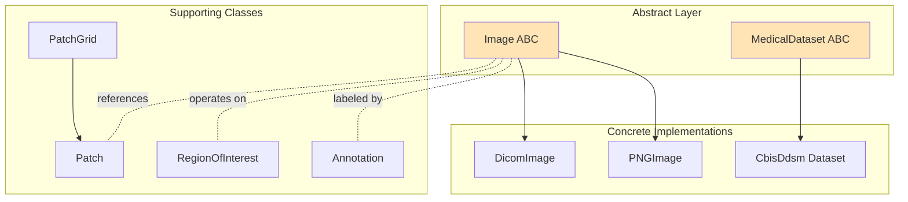
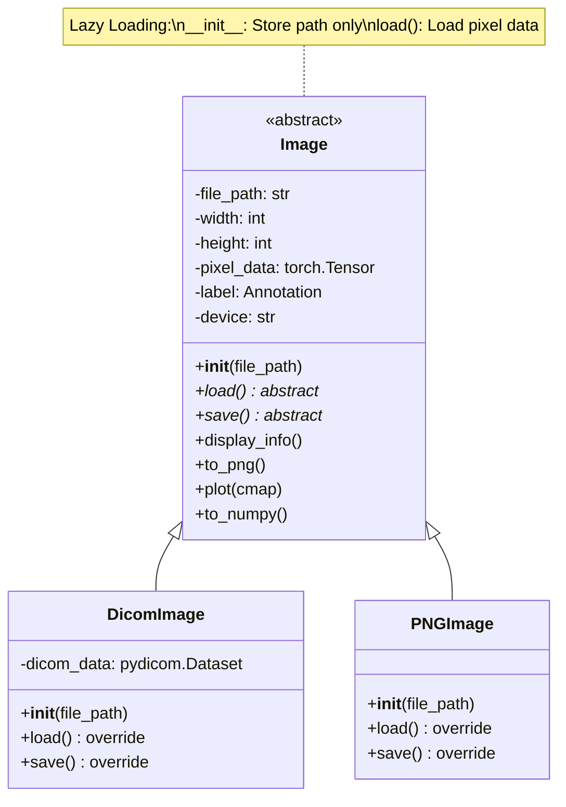
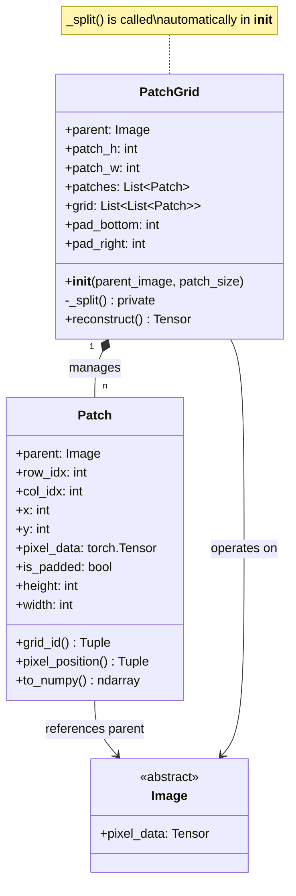
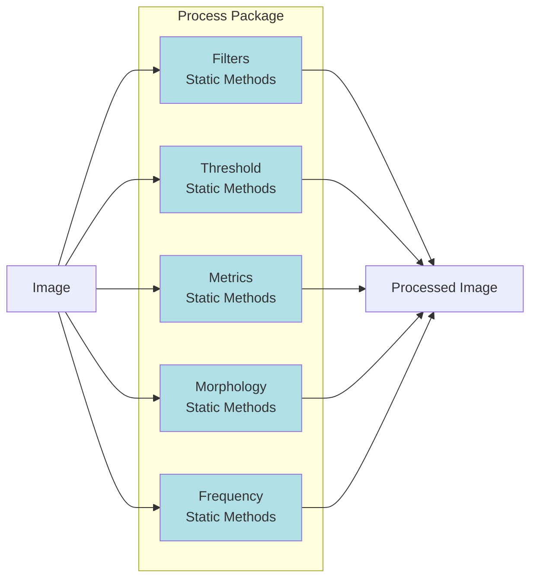
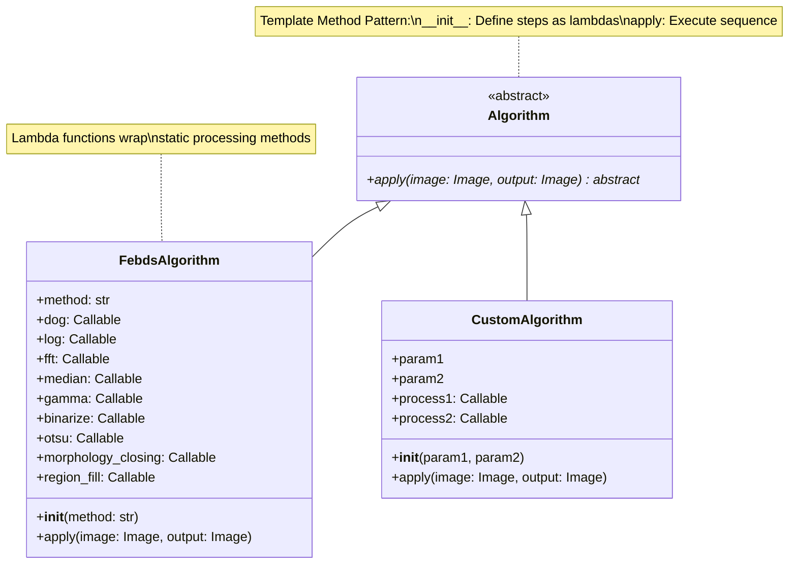
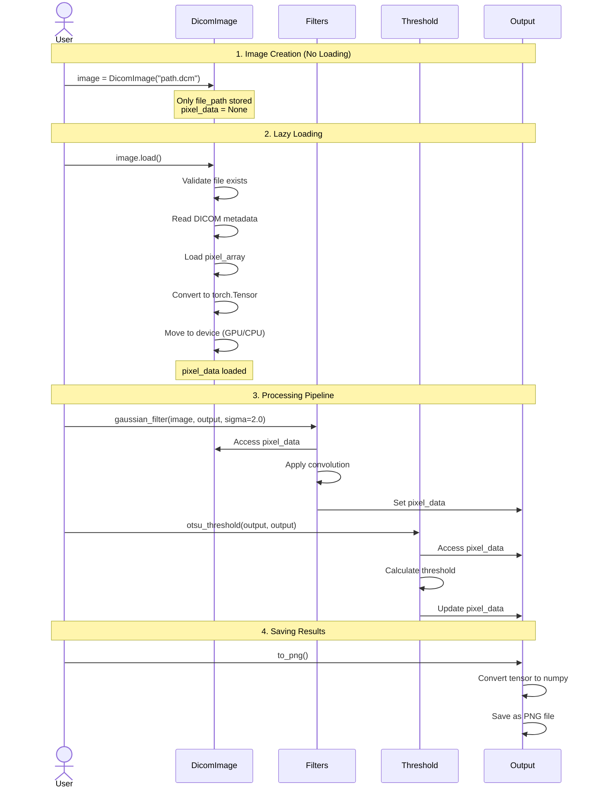
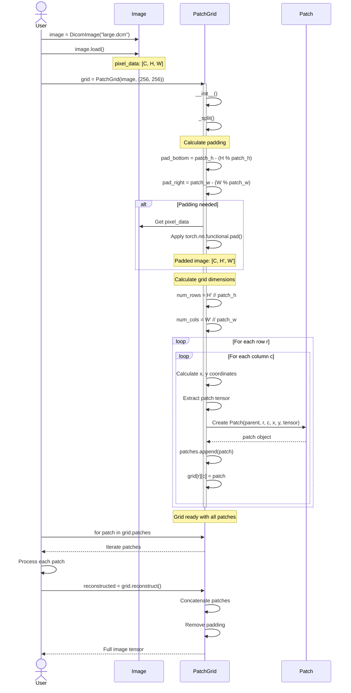
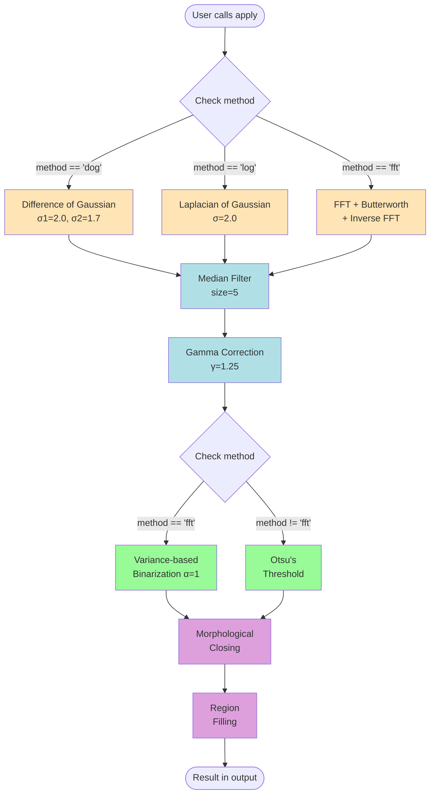
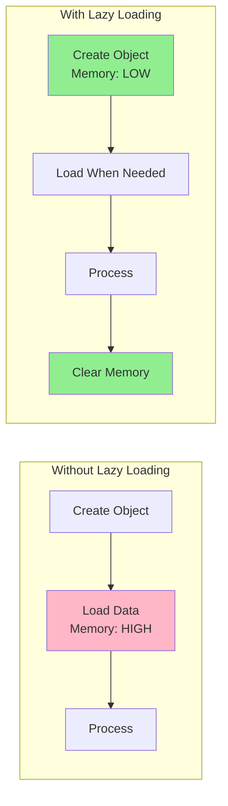
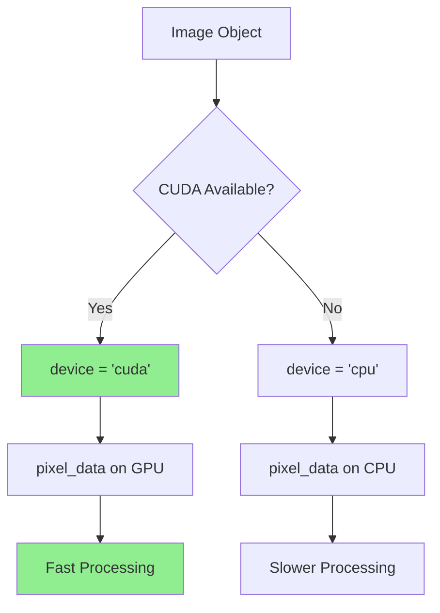

# Architecture Documentation

## Overview

This document provides detailed architectural information about the Medical Image Standard Library, including design patterns, class relationships, and workflow diagrams.

---

## Design Philosophy

### Core Principles

1. **Abstraction-First Design**
   - Define interfaces through abstract base classes
   - Concrete implementations extend abstractions
   - Ensures consistency across different image types

2. **Lazy Loading Pattern**
   - Object instantiation ≠ data loading
   - `__init__()`: Store metadata only
   - `load()`: Load actual pixel data
   - Benefits: Memory efficiency, faster initialization

3. **Static Processing Methods**
   - Processing operations are stateless
   - Organized in classes for namespace management
   - Easy to test and reuse
   - No side effects

4. **Composition over Inheritance**
   - Algorithms compose processing methods
   - Lambda functions define processing pipelines
   - Flexible and extensible

5. **Separation of Concerns**
   - **Data**: Image structures and representations
   - **Process**: Processing operations
   - **Algorithms**: High-level workflows

---

## Package Architecture

### Data Package (`medical_image.data`)

**Purpose**: Define data structures and abstractions for medical images



#### Image Class Hierarchy



#### Patch System Architecture



---

### Process Package (`medical_image.process`)

**Purpose**: Provide static processing methods organized by category



#### Processing Method Pattern

All processing methods follow this pattern:

```python
@staticmethod
def method_name(image_data: Image, output: Image, param1, param2, ...):
    """
    Process image_data and store result in output.
    
    Args:
        image_data: Input image (read-only)
        output: Output image (modified)
        param1, param2: Processing parameters
    """
    # 1. Access input data
    input_pixels = image_data.pixel_data
    
    # 2. Apply processing
    result = process(input_pixels, param1, param2)
    
    # 3. Store in output
    output.pixel_data = result
```

---

### Algorithms Package (`medical_image.algorithms`)

**Purpose**: Define high-level processing workflows



#### Algorithm Pattern

```python
class MyAlgorithm(Algorithm):
    def __init__(self, param1, param2):
        """Define processing steps as lambda functions."""
        super().__init__()
        
        # Step 1: Preprocessing
        self.preprocess = lambda img, out: Filters.gaussian_filter(
            img, out, sigma=param1
        )
        
        # Step 2: Enhancement
        self.enhance = lambda img, out: Filters.gamma_correction(
            img, out, gamma=param2
        )
        
        # Step 3: Segmentation
        self.segment = lambda img, out: Threshold.otsu_threshold(img, out)
    
    def apply(self, image: Image, output: Image):
        """Execute the sequence of processing steps."""
        # Execute lambda functions in order
        self.preprocess(image, output)
        self.enhance(output, output)
        self.segment(output, output)
```

---

## Workflow Diagrams

### Complete Image Processing Workflow



### PatchGrid Detailed Workflow



### FEBDS Algorithm Execution Flow



---

## Design Patterns

### 1. Abstract Factory Pattern

**Used in**: Image class hierarchy

```python
# Abstract factory
class Image(ABC):
    @abstractmethod
    def load(self): pass
    
    @abstractmethod
    def save(self): pass

# Concrete factories
class DicomImage(Image):
    def load(self):
        # DICOM-specific loading
        pass

class PNGImage(Image):
    def load(self):
        # PNG-specific loading
        pass
```

### 2. Template Method Pattern

**Used in**: Algorithm class

```python
class Algorithm(ABC):
    # Template method
    @abstractmethod
    def apply(self, image, output):
        pass

class FebdsAlgorithm(Algorithm):
    def __init__(self, method):
        # Define steps
        self.step1 = lambda: ...
        self.step2 = lambda: ...
    
    def apply(self, image, output):
        # Execute template
        self.step1()
        self.step2()
```

### 3. Strategy Pattern

**Used in**: FEBDS method selection

```python
class FebdsAlgorithm:
    def apply(self, image, output):
        # Strategy selection
        if self.method == "dog":
            self.dog(image, output)
        elif self.method == "log":
            self.log(image, output)
        elif self.method == "fft":
            self.fft(image, output)
```

### 4. Lazy Initialization Pattern

**Used in**: Image loading

```python
class Image:
    def __init__(self, file_path):
        self.file_path = file_path
        self.pixel_data = None  # Not loaded yet
    
    def load(self):
        # Load only when called
        self.pixel_data = load_from_file(self.file_path)
```

---

## Memory Management

### Lazy Loading Benefits



### Memory Lifecycle

```python
# 1. Object creation - minimal memory
image = DicomImage("large_file.dcm")  # Only path stored

# 2. Load data - memory allocated
image.load()  # pixel_data loaded to GPU/CPU

# 3. Process - working memory
Filters.gaussian_filter(image, output, sigma=2.0)

# 4. Clear memory
del image
torch.cuda.empty_cache()  # Free GPU memory
```

---

## Extension Points

### Adding New Image Format

```python
from medical_image.data.image import Image

class TIFFImage(Image):
    def __init__(self, file_path):
        super().__init__(file_path)
        # TIFF-specific initialization
    
    def load(self):
        # Implement TIFF loading
        from PIL import Image as PILImage
        img = PILImage.open(self.file_path)
        self.pixel_data = torch.from_numpy(np.array(img))
        self.width, self.height = img.size
    
    def save(self):
        # Implement TIFF saving
        pass
```

### Adding New Processing Method

```python
class Filters:
    @staticmethod
    def bilateral_filter(image_data: Image, output: Image, 
                        sigma_color: float, sigma_space: float):
        """Add new filter to existing class."""
        # Implementation
        pass
```

### Adding New Algorithm

```python
from medical_image.algorithms.algorithm import Algorithm

class MyCustomAlgorithm(Algorithm):
    def __init__(self, param1, param2):
        super().__init__()
        # Define processing steps as lambdas
        self.step1 = lambda img, out: Filters.gaussian_filter(
            img, out, sigma=param1
        )
        self.step2 = lambda img, out: Threshold.otsu_threshold(img, out)
    
    def apply(self, image: Image, output: Image):
        # Execute sequence
        self.step1(image, output)
        self.step2(output, output)
```

---

## Performance Considerations

### GPU Acceleration



### Patch-based Processing for Large Images

```python
# For very large images
large_image = DicomImage("4096x4096.dcm")
large_image.load()

# Process in patches to manage memory
patch_grid = PatchGrid(large_image, patch_size=(512, 512))

for patch in patch_grid.patches:
    # Process each patch independently
    process_patch(patch.pixel_data)
    
# Reconstruct
result = patch_grid.reconstruct()
```

---

## Testing Architecture

### Test Organization

```
medical_image/tests/
├── __init__.py
├── test_dicom.py          # DICOM image tests (run by CI)
├── test_dataset.py        # Dataset tests
├── test_filters.py        # Filter tests
├── test_threshold.py      # Threshold tests
├── test_patch.py          # Patch system tests
└── dummy_data/            # Test data
    └── sample.dcm
```

### Test Pattern

```python
class TestFeature:
    """Test suite for a specific feature."""
    
    def test_basic_functionality(self):
        """Test basic use case."""
        # Arrange
        input_data = create_test_data()
        
        # Act
        result = process(input_data)
        
        # Assert
        assert result is not None
        assert result.shape == expected_shape
    
    def test_edge_cases(self):
        """Test edge cases and error handling."""
        with pytest.raises(ValueError):
            process(invalid_input)
```

---

## Summary

The Medical Image Standard Library follows a clean, extensible architecture:

- **Abstract base classes** define standard interfaces
- **Lazy loading** optimizes memory usage
- **Static methods** provide stateless processing
- **Lambda composition** enables flexible algorithms
- **Patch system** handles large images efficiently
- **GPU acceleration** improves performance

This architecture makes it easy to:
- Add new image formats
- Implement new processing methods
- Create custom algorithms
- Maintain and test code
