# Architecture Documentation

## Overview

This document provides detailed architectural information about the Medical Image Standard Library, including design patterns, class relationships, and workflow diagrams.

---

## Design Philosophy

### Core Principles

1. **Abstraction-First Design**
   - Define interfaces through abstract base classes
   - Concrete implementations extend abstractions
   - Ensures consistency across different image types

2. **Lazy Loading Pattern**
   - Object instantiation does not imply data loading
   - `__init__()`: Store metadata only
   - `load()`: Load actual pixel data
   - Benefits: Memory efficiency, faster initialization

3. **Device-Aware Processing**
   - All processing methods accept `device=None` by default
   - Device is resolved at call time via `resolve_device()`
   - Priority: explicit parameter > image device > CPU fallback

4. **Composition over Inheritance**
   - Algorithms compose processing methods
   - Lambda functions define processing pipelines
   - Flexible and extensible

5. **Separation of Concerns**
   - **Data**: Image structures and representations
   - **Process**: Processing operations
   - **Algorithms**: High-level workflows
   - **Utils**: Device management, logging, annotations

---

## Package Architecture

### Data Package (`medical_image.data`)

**Purpose**: Define data structures and abstractions for medical images

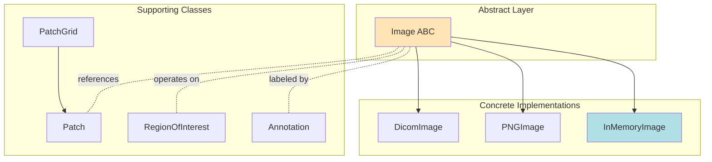

### Datasets Package (`medical_image.datasets`)

**Purpose**: Production-grade PyTorch Dataset classes with lazy loading, automatic file pairing, and standardized output dictionaries.

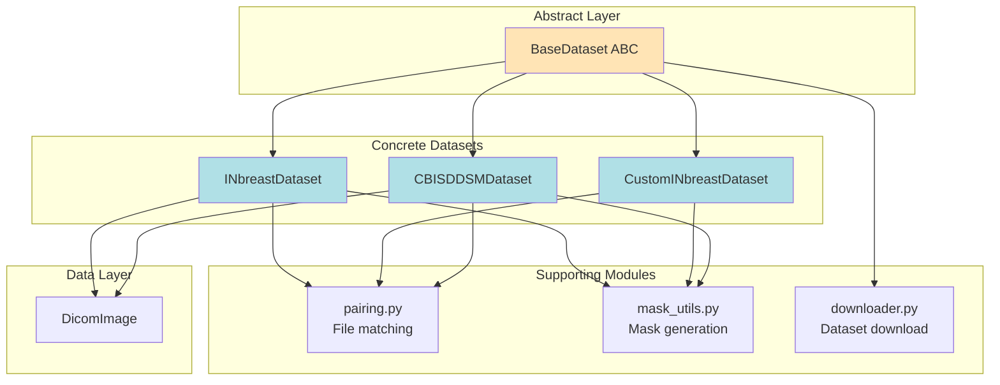

**Key patterns:**
- **Template Method**: `BaseDataset.__getitem__` calls abstract `_load_sample`, then applies transforms and resizing
- **Lazy Loading**: Images loaded from disk on each access, never pre-loaded
- **Data Classes**: `INbreastSample`, `CBISDDSMSample`, etc. as typed sample containers
- **Strategy**: `CBISDDSMDataset` dispatches between `_load_full_image` and `_load_patch` based on mode

#### Image Class Hierarchy

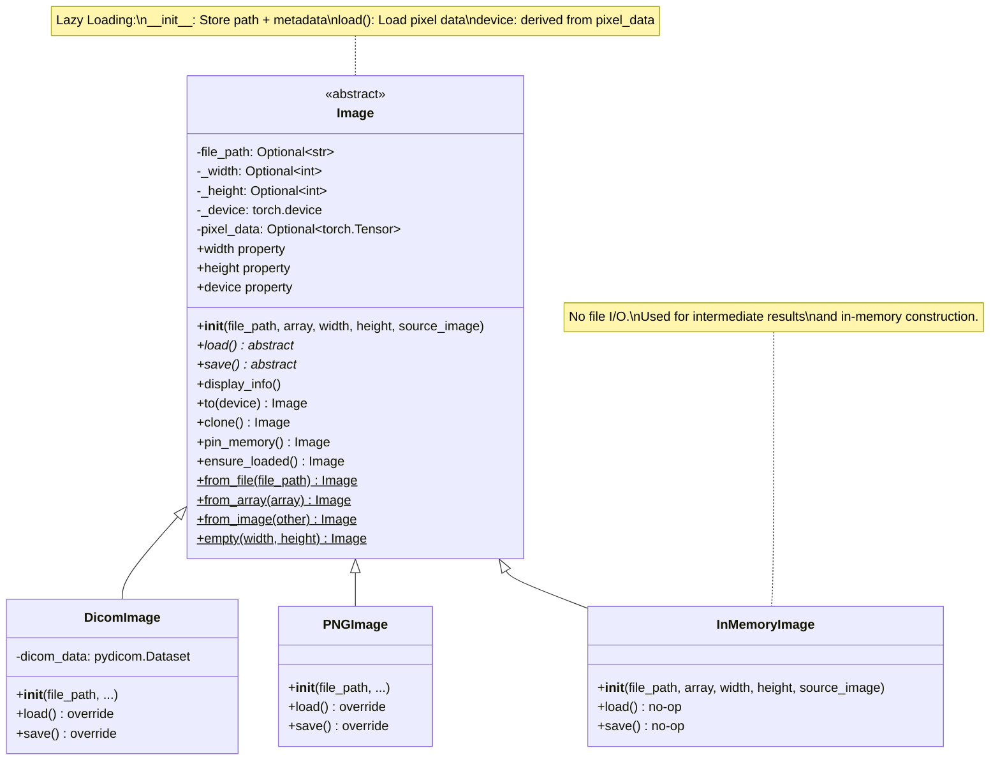

#### Patch System Architecture

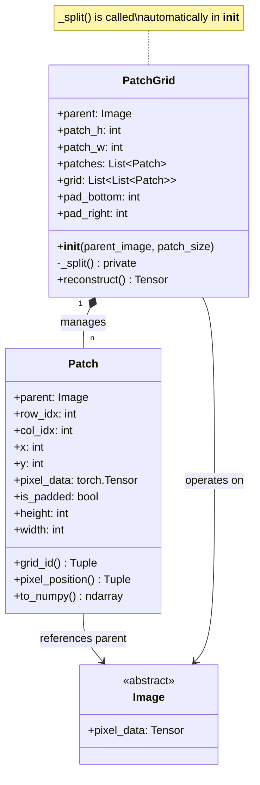

---

### Process Package (`medical_image.process`)

**Purpose**: Provide static processing methods organized by category

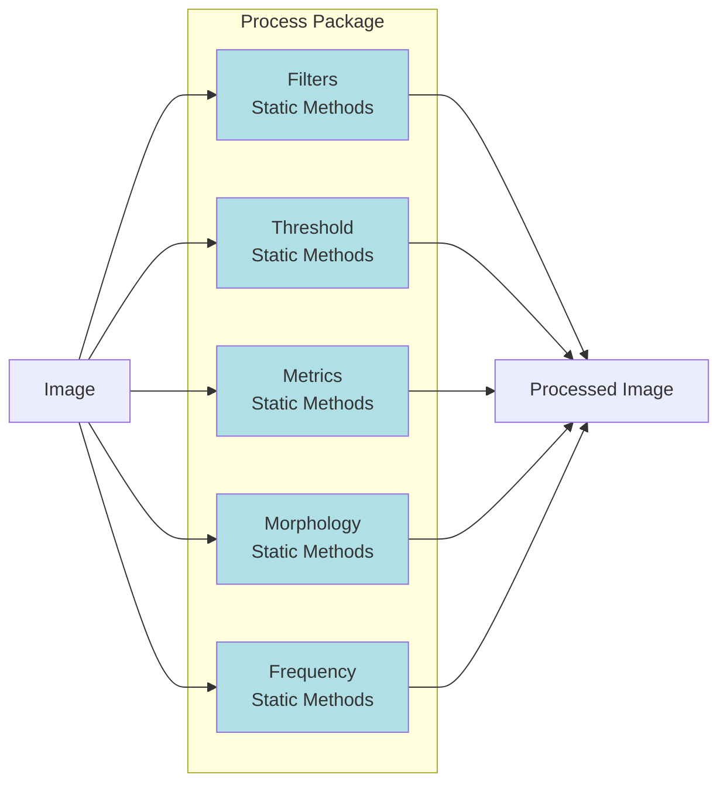

#### Processing Method Pattern

All processing methods follow this pattern:

```python
@staticmethod
@requires_loaded
def method_name(image: Image, output: Image, param1, param2, ..., device=None):
    """
    Process image and store result in output.

    Args:
        image: Input image (read-only)
        output: Output image (modified)
        param1, param2: Processing parameters
        device: Target device (None = infer from image)
    """
    # 1. Resolve device
    device = resolve_device(image, explicit=device)

    # 2. Access input data on target device
    img = image.pixel_data.to(device).float()

    # 3. Apply processing
    result = process(img, param1, param2)

    # 4. Store in output
    output.pixel_data = result
```

---

### Algorithms Package (`medical_image.algorithms`)

**Purpose**: Define high-level processing workflows

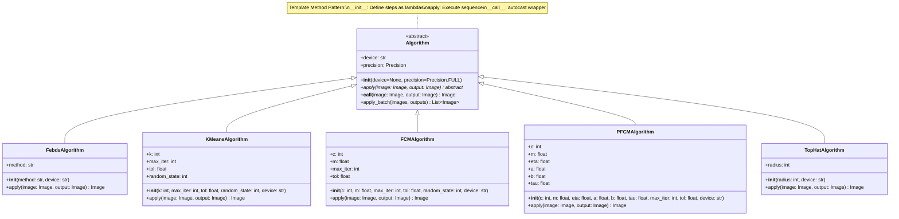

#### Algorithm Pattern

```python
class MyAlgorithm(Algorithm):
    def __init__(self, param1, param2, device="cpu"):
        """Define processing steps as lambda functions."""
        super().__init__(device=device)

        # Step 1: Preprocessing
        self.preprocess = lambda img, out: Filters.gaussian_filter(
            image=img, output=out, sigma=param1, device=self.device
        )

        # Step 2: Enhancement
        self.enhance = lambda img, out: Filters.gamma_correction(
            image=img, output=out, gamma=param2, device=self.device
        )

        # Step 3: Segmentation
        self.segment = lambda img, out: Threshold.otsu_threshold(
            image=img, output=out, device=self.device
        )

    def apply(self, image: Image, output: Image) -> Image:
        """Execute the sequence of processing steps."""
        self.preprocess(image, output)
        self.enhance(output, output)
        self.segment(output, output)
        return output
```

The `__call__` method on `Algorithm` wraps `apply()` with `torch.cuda.amp.autocast` when `precision` is not `Precision.FULL` and the device is not CPU:

```python
def __call__(self, image, output):
    if self.precision != Precision.FULL and self.device != "cpu":
        with torch.cuda.amp.autocast(dtype=self.precision.value):
            self.apply(image, output)
    else:
        self.apply(image, output)
    return output
```

---

## Device Flow Architecture

### resolve_device Priority

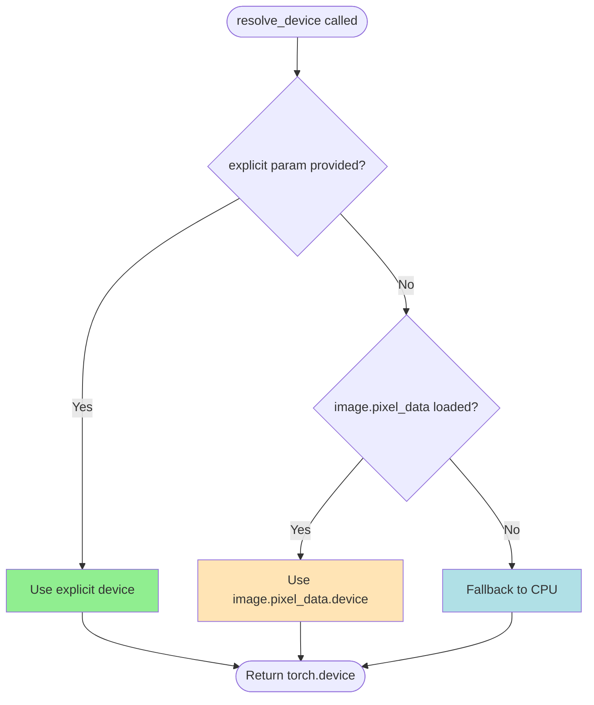

### Device Management Components

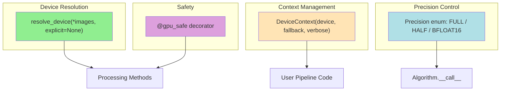

All processing methods (`Filters`, `Threshold`, `Morphology`, `Frequency`) accept `device=None` and call `resolve_device(image, explicit=device)` internally. This means the caller can either:

- Pass an explicit device: `Filters.gaussian_filter(image, output, sigma=2.0, device="cuda:0")`
- Let it infer from the image: `Filters.gaussian_filter(image, output, sigma=2.0)`
- Get CPU fallback if nothing else is available

---

## Workflow Diagrams

### Complete Image Processing Workflow

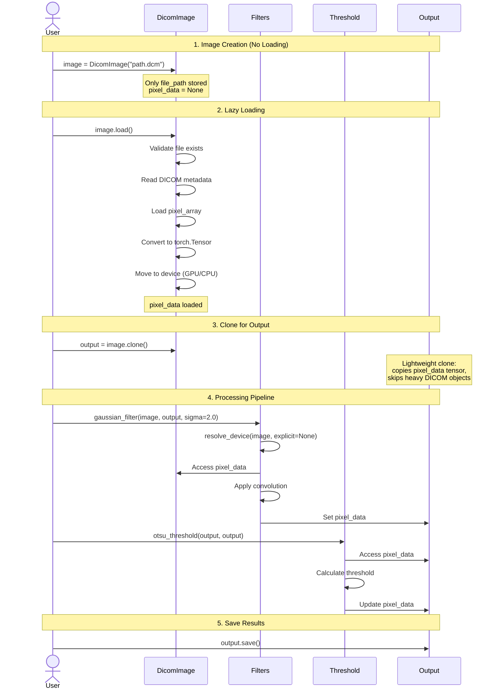

### PatchGrid Detailed Workflow

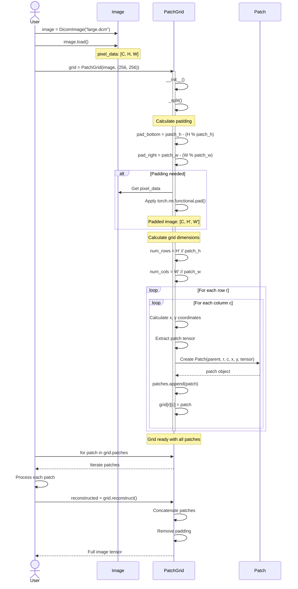

### FEBDS Algorithm Execution Flow

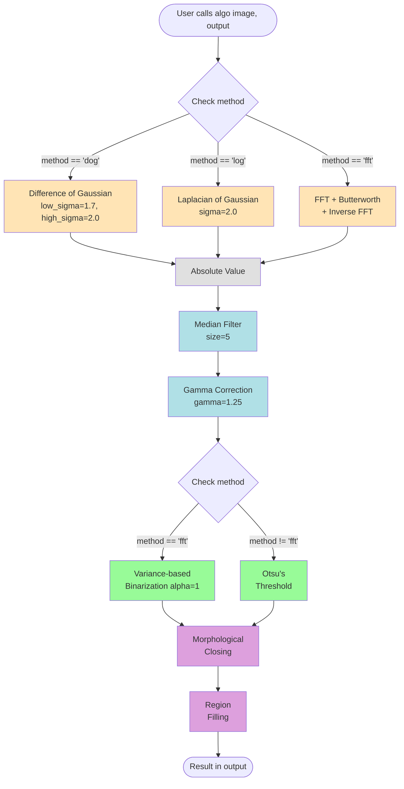

---

## Design Patterns

### 1. Abstract Factory Pattern

**Used in**: Image class hierarchy

```python
# Abstract factory
class Image(ABC):
    @abstractmethod
    def load(self): pass

    @abstractmethod
    def save(self): pass

# Concrete implementations
class DicomImage(Image):
    def load(self):
        # DICOM-specific loading
        pass

class PNGImage(Image):
    def load(self):
        # PNG-specific loading
        pass

class InMemoryImage(Image):
    def load(self):
        pass  # no-op: data already in memory

    def save(self):
        pass  # no-op: no backing file
```

### 2. Template Method Pattern

**Used in**: Algorithm class

```python
class Algorithm(ABC):
    def __init__(self, device=None, precision=Precision.FULL):
        self.device = device or ("cuda" if torch.cuda.is_available() else "cpu")
        self.precision = precision

    @abstractmethod
    def apply(self, image, output):
        pass

    def __call__(self, image, output):
        # Wraps apply() with optional autocast
        ...

class FebdsAlgorithm(Algorithm):
    def __init__(self, method, device="cpu"):
        super().__init__(device=device)
        # Define steps as lambdas
        self.dog = lambda img, out: Filters.difference_of_gaussian(...)
        self.median = lambda img, out: Filters.median_filter(...)

    def apply(self, image, output):
        # Execute template
        self.dog(image, output)
        self.median(output, output)
        ...
```

### 3. Strategy / Template Method Pattern

**Used in**: Algorithms and FEBDS method selection

The `Algorithm` base class dictates a common interface via `apply()`. Subclasses like `KMeansAlgorithm` instantiate the steps of the process inside `__init__()`. Some algorithms (like `FebdsAlgorithm`) leverage internal strategy switching to select operations.

```python
class FebdsAlgorithm:
    def apply(self, image, output):
        # Strategy selection
        if self.method == "dog":
            self.dog(image, output)
        elif self.method == "log":
            self.log(image, output)
        elif self.method == "fft":
            self.fft(image, output)

class KMeansAlgorithm(Algorithm):
    def __init__(self, k=2, max_iter=100, tol=1e-4, random_state=42, device="cpu"):
        super().__init__(device=device)
        # Define steps using templates
        self.compute_distances = lambda Z, V: ...

    def apply(self, image, output):
        # Execute template strictly in order
        ...
```

### 4. Lazy Initialization Pattern

**Used in**: Image loading

```python
class Image:
    def __init__(self, file_path=None, array=None, ...):
        self.file_path = file_path
        self.pixel_data = None  # Not loaded yet
        self._device = torch.device("cpu")

    def load(self):
        # Load only when called
        self.pixel_data = load_from_file(self.file_path)

    def ensure_loaded(self):
        """Guard: raise if pixel_data is None."""
        if self.pixel_data is None:
            raise DicomDataNotLoadedError("Call .load() first")
        return self
```

---

## Memory Management

### Lazy Loading Benefits

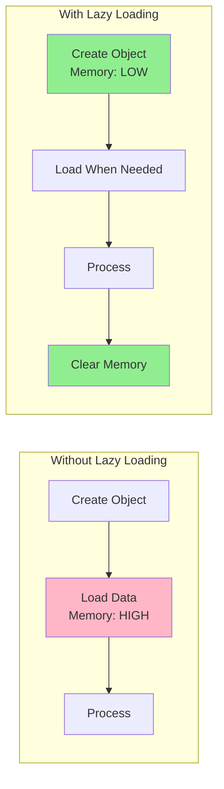

### Memory Lifecycle

```python
# 1. Object creation - minimal memory
image = DicomImage("large_file.dcm")  # Only path stored

# 2. Load data - memory allocated
image.load()  # pixel_data loaded to device

# 3. Clone for output (lightweight, no deep copy)
output = image.clone()  # clones pixel_data tensor, skips heavy DICOM objects

# 4. Process
Filters.gaussian_filter(image, output, sigma=2.0)

# 5. Clear memory
del image
torch.cuda.empty_cache()  # Free GPU memory
```

### DeviceContext Manager

`DeviceContext` provides GPU-aware processing with automatic memory management:

```python
from medical_image import DeviceContext

with DeviceContext("cuda", verbose=True) as ctx:
    image.to(ctx.device)
    output = image.clone()
    algo = FebdsAlgorithm(method="dog", device=str(ctx.device))
    algo(image, output)
# GPU cache automatically cleared on exit
```

Features:
- Clears GPU cache on entry and exit
- Provides `memory_stats()` for tracking GPU usage
- Automatic CPU fallback when CUDA is unavailable
- Suppresses OOM exceptions and falls back to CPU

### pin_memory for Faster GPU Transfers

```python
image.load()
image.pin_memory()  # Pin to page-locked memory
image.to("cuda")    # Non-blocking transfer possible
```

### gpu_safe Decorator

The `@gpu_safe` decorator catches CUDA OOM errors and retries the operation on CPU:

```python
from medical_image import gpu_safe

@gpu_safe
def my_processing(image, output, device=None):
    Filters.gaussian_filter(image, output, sigma=2.0, device=device)
    return output
```

---

## Extension Points

### Adding New Image Format

```python
from medical_image.data.image import Image

class TIFFImage(Image):
    def __init__(self, file_path=None, **kwargs):
        super().__init__(file_path=file_path, **kwargs)

    def load(self):
        from PIL import Image as PILImage
        img = PILImage.open(self.file_path)
        self.pixel_data = torch.from_numpy(np.array(img)).float()

    def save(self):
        # Implement TIFF saving
        pass
```

### Adding New Processing Method

```python
class Filters:
    @staticmethod
    @requires_loaded
    def bilateral_filter(image: Image, output: Image,
                        sigma_color: float, sigma_space: float,
                        device=None):
        """Add new filter to existing class."""
        device = resolve_device(image, explicit=device)
        img = image.pixel_data.to(device).float()
        # Implementation
        output.pixel_data = result
```

### Adding New Algorithm

```python
from medical_image.algorithms.algorithm import Algorithm
from medical_image.utils.device import Precision

class MyCustomAlgorithm(Algorithm):
    def __init__(self, param1, param2, device="cpu", precision=Precision.FULL):
        super().__init__(device=device, precision=precision)
        # Define processing steps as lambdas
        self.step1 = lambda img, out: Filters.gaussian_filter(
            image=img, output=out, sigma=param1, device=self.device
        )
        self.step2 = lambda img, out: Threshold.otsu_threshold(
            image=img, output=out, device=self.device
        )

    def apply(self, image: Image, output: Image) -> Image:
        # Execute sequence
        self.step1(image, output)
        self.step2(output, output)
        return output
```

---

## Performance Considerations

### GPU Acceleration

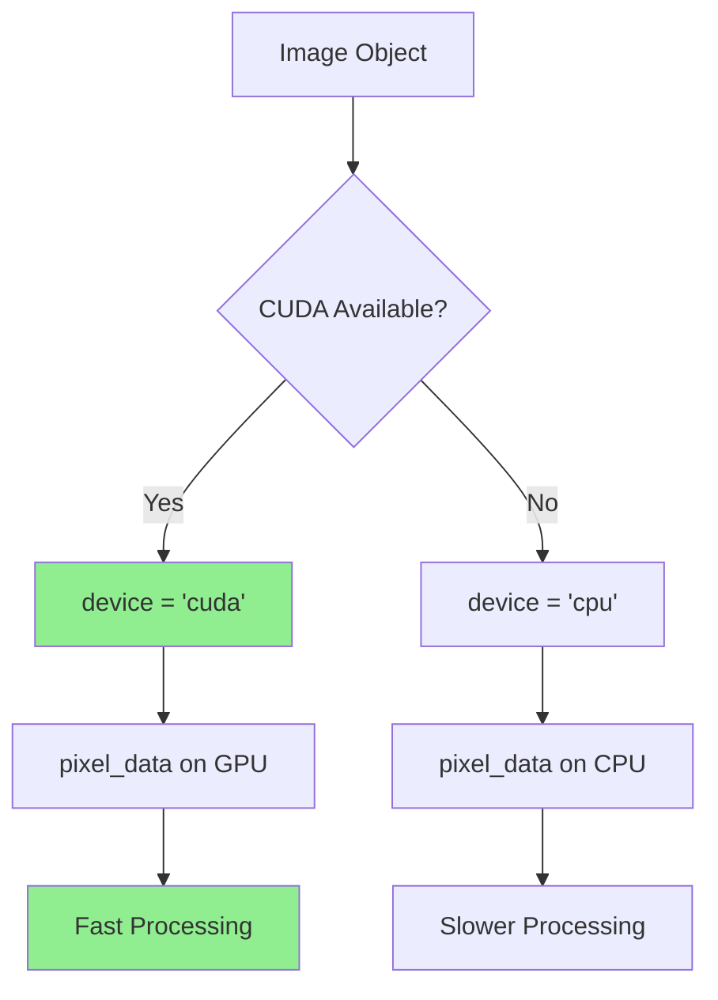

### Mixed Precision

The `Algorithm` base class supports mixed precision via the `Precision` enum:

```python
from medical_image.utils.device import Precision

algo = FebdsAlgorithm(method="dog", device="cuda")
algo.precision = Precision.HALF  # Use float16

# __call__ wraps apply() with autocast
algo(image, output)  # Runs under torch.cuda.amp.autocast
```

Available precision modes: `Precision.FULL` (float32), `Precision.HALF` (float16), `Precision.BFLOAT16` (bfloat16).

### Batch Processing

```python
algo = KMeansAlgorithm(k=3, device="cuda")
outputs = algo.apply_batch(images, output_images)
```

The default `apply_batch()` loops over `apply()`. Subclasses can override for truly batched GPU processing.

### Patch-based Processing for Large Images

```python
# For very large images
large_image = DicomImage("4096x4096.dcm")
large_image.load()

# Process in patches to manage memory
patch_grid = PatchGrid(large_image, patch_size=(512, 512))

for patch in patch_grid.patches:
    # Process each patch independently
    process_patch(patch.pixel_data)

# Reconstruct
result = patch_grid.reconstruct()
```

---

## Testing Architecture

### Test Organization

```
medical_image/tests/
├── __init__.py
├── test_dicom.py              # DICOM loading, filters vs scikit-image, morphology vs scipy, FEBDS pipeline, patches
├── test_mc_algorithms.py      # KMeans, FCM, PFCM, TopHat, full pipeline integration, ROI extraction
├── test_gpu.py                # Device inference, DeviceContext, Precision, pin_memory, all modules on CPU+CUDA, batch ops
└── dummy_data/                # Test data
    └── sample.dcm
```

### Test Pattern

```python
class TestFeature:
    """Test suite for a specific feature."""

    def test_basic_functionality(self):
        """Test basic use case."""
        # Arrange
        input_data = create_test_data()

        # Act
        result = process(input_data)

        # Assert
        assert result is not None
        assert result.shape == expected_shape

    def test_edge_cases(self):
        """Test edge cases and error handling."""
        with pytest.raises(ValueError):
            process(invalid_input)
```

---

## Summary

The Medical Image Standard Library follows a clean, extensible architecture:

- **Abstract base classes** define standard interfaces (`Image`, `Algorithm`)
- **Lazy loading** optimizes memory usage
- **Device-aware processing** via `resolve_device()` with explicit > image > CPU priority
- **Lambda composition** enables flexible algorithm pipelines
- **Mixed precision** support through `Precision` enum and `autocast`
- **Memory management** with `DeviceContext`, `pin_memory()`, `clone()`, and `@gpu_safe`
- **Patch system** handles large images efficiently
- **GPU acceleration** with automatic fallback

This architecture makes it easy to:
- Add new image formats (extend `Image` ABC)
- Implement new processing methods (add static methods with `device=None` + `resolve_device()`)
- Create custom algorithms (extend `Algorithm`, define steps as lambdas)
- Maintain and test code