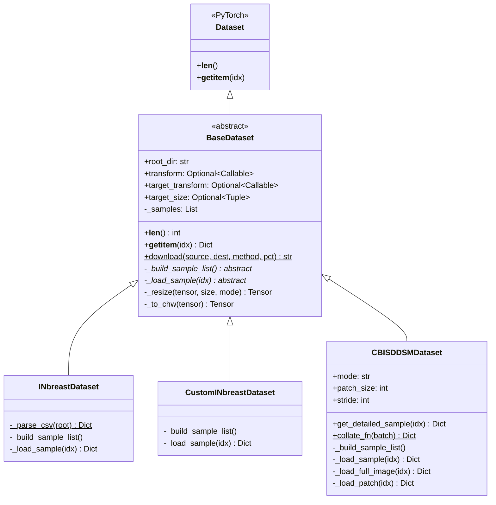
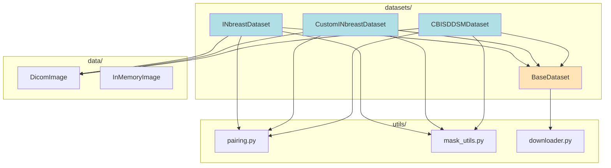
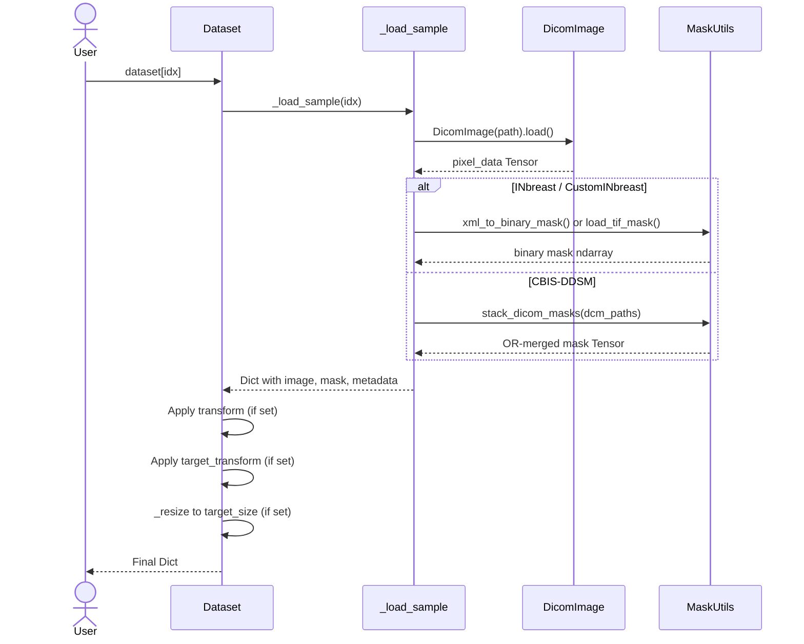
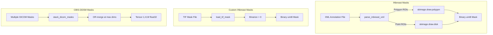

# Dataset Guide

## Overview

The `medical_image.datasets` package provides production-grade PyTorch `Dataset` classes for medical image loading, with lazy loading, automatic file pairing, and configurable transforms. All datasets return standardized dictionaries containing image tensors, masks/labels, and metadata.

---

## Table of Contents

1. [BaseDataset (Abstract)](#basedataset-abstract)
2. [INbreastDataset](#inbreastdataset)
3. [CustomINbreastDataset](#custominbreastdataset)
4. [CBISDDSMDataset](#cbisddsmdataset)
5. [Software Architecture](#software-architecture)
6. [Data Flow & Patterns](#data-flow--patterns)
7. [PyTorch Integration](#pytorch-integration)
8. [Creating Custom Datasets](#creating-custom-datasets)
9. [Best Practices](#best-practices)
10. [Troubleshooting](#troubleshooting)

---

## BaseDataset (Abstract)

`BaseDataset` is the abstract base class that all dataset implementations extend. It inherits from `torch.utils.data.Dataset` and enforces a lazy-loading contract: images are never pre-loaded into memory.

### Class Signature

```python
class BaseDataset(Dataset, ABC):
    def __init__(
        self,
        root_dir: str,
        transform: Optional[Callable] = None,
        target_transform: Optional[Callable] = None,
        target_size: Optional[Tuple[int, int]] = None,
    ):
```

### Constructor Parameters

| Parameter | Type | Default | Description |
|-----------|------|---------|-------------|
| `root_dir` | `str` | required | Root directory containing dataset files |
| `transform` | `Optional[Callable]` | `None` | Transform applied to image tensors |
| `target_transform` | `Optional[Callable]` | `None` | Transform applied to mask tensors |
| `target_size` | `Optional[Tuple[int, int]]` | `None` | `(H, W)` to resize all outputs |

### Key Attributes

| Attribute | Type | Description |
|-----------|------|-------------|
| `root_dir` | `str` | Root directory path |
| `transform` | `Optional[Callable]` | Image transform pipeline |
| `target_transform` | `Optional[Callable]` | Mask transform pipeline |
| `target_size` | `Optional[Tuple[int, int]]` | Resize target dimensions |
| `_samples` | `List[Any]` | Internal sample list, populated by `_build_sample_list()` |

### Abstract Methods

Subclasses **must** implement:

| Method | Signature | Purpose |
|--------|-----------|---------|
| `_build_sample_list` | `() -> None` | Scan dataset directory, pair files, populate `self._samples` |
| `_load_sample` | `(idx: int) -> Dict[str, Any]` | Load a single sample from disk on demand |

### Built-in Methods

| Method | Signature | Returns | Description |
|--------|-----------|---------|-------------|
| `__len__` | `() -> int` | `int` | Number of samples in `_samples` |
| `__getitem__` | `(idx: int) -> Dict[str, Any]` | `dict` | Load sample, apply transforms, resize |
| `_resize` | `(tensor, size, mode) -> Tensor` | `Tensor` | Resize a 2D/3D tensor to target size |
| `_to_chw` | `(tensor) -> Tensor` | `Tensor` | Ensure tensor is in `(C, H, W)` format |
| `download` | `(source, destination, method, percentage) -> str` | `str` | Class method to download datasets |

### Output Contract

Every `__getitem__` call returns a dictionary with at minimum:

```python
{
    "image": torch.Tensor,    # Shape: [C, H, W], float32
    "mask": torch.Tensor,     # Shape: [1, H, W], float32 (segmentation datasets)
    # OR
    "label": int,             # Classification datasets
    "metadata": dict,         # Dataset-specific metadata
}
```

### Architecture Diagram



---

## INbreastDataset

PyTorch Dataset for the **INbreast** mammography database. Pairs DICOM images with XML annotation files to generate binary segmentation masks.

### Constructor

```python
INbreastDataset(
    root_dir: str,
    transform: Optional[Callable] = None,
    target_transform: Optional[Callable] = None,
    target_size: Optional[Tuple[int, int]] = None,
)
```

### Expected Directory Layout

```
root_dir/
└── INbreast Release 1.0/
    ├── AllDICOMs/          # *.dcm mammogram files
    ├── AllXML/             # *.xml annotation files (plist format)
    ├── AllROI/             # Optional ROI images
    └── INbreast.csv        # Metadata CSV
```

### File Pairing Logic

Files are paired by **numeric ID prefix**:
- DICOM: `20586908_abc123.dcm` -> ID `20586908`
- XML: `20586908.xml` -> ID `20586908`

Uses `pair_inbreast()` from `medical_image.utils.pairing`.

### Sample Output

```python
sample = dataset[0]
# {
#     "image": Tensor[1, H, W],       # DICOM pixel data, float32
#     "mask": Tensor[1, H, W],        # Binary mask from XML polygons
#     "metadata": {
#         "case_id": "20586908",
#         "laterality": "L",           # L or R
#         "view": "CC",                # CC or MLO
#         "birads": 4,                 # BI-RADS classification (1-6)
#         "file_name": "20586908_abc123.dcm"
#     }
# }
```

### Methods

| Method | Input | Output | Description |
|--------|-------|--------|-------------|
| `_build_sample_list()` | None | None | Pairs DICOMs with XMLs via numeric ID matching, populates `_samples` with `INbreastSample` dataclasses |
| `_load_sample(idx)` | `int` | `Dict` | Loads DICOM via `DicomImage`, generates binary mask from XML using `xml_to_binary_mask()` |
| `_parse_csv(root)` | `Path` | `Dict[str, Dict]` | Static method. Parses `INbreast.csv` for laterality, view, BI-RADS metadata |

### Dependencies

- `DicomImage` from `medical_image.data` for DICOM loading
- `pair_inbreast()` from `medical_image.utils.pairing` for file matching
- `xml_to_binary_mask()` from `medical_image.utils.mask_utils` for mask generation

---

## CustomINbreastDataset

Extended INbreast dataset that supports **pre-generated TIF masks** in addition to XML annotations. Prioritizes TIF masks over XML-generated masks.

### Constructor

```python
CustomINbreastDataset(
    root_dir: str,
    transform: Optional[Callable] = None,
    target_transform: Optional[Callable] = None,
    target_size: Optional[Tuple[int, int]] = None,
)
```

### Expected Directory Layout

```
root_dir/
├── AllMasks/                   # <case_id>_mask.tif pre-generated masks
└── INbreast Release 1.0/
    ├── AllDICOMs/
    ├── AllXML/
    └── AllROI/
```

### Mask Loading Priority

1. **TIF mask** (`AllMasks/<case_id>_mask.tif`) — highest priority
2. **XML annotation** (parsed into binary mask) — fallback
3. **Empty mask** (all zeros) — if no annotation exists

### Sample Output

```python
sample = dataset[0]
# {
#     "image": Tensor[1, H, W],
#     "mask": Tensor[1, H, W],
#     "metadata": {
#         "case_id": "20586908",
#         "laterality": "L",
#         "view": "CC",
#         "birads": 4,
#         "file_name": "20586908_abc123.dcm",
#         "mask_source": "tif"   # "tif", "xml", or "empty"
#     }
# }
```

### Methods

| Method | Input | Output | Description |
|--------|-------|--------|-------------|
| `_build_sample_list()` | None | None | Pairs DICOMs with XMLs and TIF masks via `pair_custom_inbreast()` |
| `_load_sample(idx)` | `int` | `Dict` | Loads DICOM + mask with TIF > XML > empty priority |

---

## CBISDDSMDataset

Large-scale dataset for the **CBIS-DDSM** (Curated Breast Imaging Subset of Digital Database for Screening Mammography). Supports two loading modes: **full-image** and **patch-based**.

### Constructor

```python
CBISDDSMDataset(
    root_dir: str,
    mode: Literal["full_image", "patch"] = "full_image",
    patch_size: int = 512,
    stride: int = 256,
    transform: Optional[Callable] = None,
    target_transform: Optional[Callable] = None,
    target_size: Optional[Tuple[int, int]] = None,
    percentage: Optional[float] = None,
    seed: int = 42,
)
```

### Constructor Parameters

| Parameter | Type | Default | Description |
|-----------|------|---------|-------------|
| `root_dir` | `str` | required | Path to CBIS-DDSM manifest directory |
| `mode` | `Literal["full_image", "patch"]` | `"full_image"` | Loading mode |
| `patch_size` | `int` | `512` | Square patch side length (patch mode only) |
| `stride` | `int` | `256` | Stride between patches (patch mode only) |
| `percentage` | `Optional[float]` | `None` | Subset selection ratio in `(0, 1]` |
| `seed` | `int` | `42` | Random seed for subset reproducibility |

### Expected Directory Layout

```
root_dir/
└── CBIS-DDSM/
    ├── Calc-Training_P_00038_LEFT_CC/
    │   ├── .../.../1-1.dcm              # Full mammogram
    │   └── ...
    ├── Calc-Training_P_00038_LEFT_CC_1/ # ROI/mask folder
    │   ├── .../.../1-1.dcm              # ROI crop
    │   └── .../.../1-2.dcm              # Mask
    └── ...
```

### Loading Modes

#### Full Image Mode (`mode="full_image"`)

Loads the entire mammogram with all ROI masks OR-merged into a single binary mask.

```python
dataset = CBISDDSMDataset(root_dir="/data/ddsm", mode="full_image")
sample = dataset[0]
# {
#     "image": Tensor[1, H, W],       # Full mammogram
#     "mask": Tensor[1, H, W],        # OR-merged binary mask of all ROIs
#     "metadata": {
#         "case_id": "Calc-Training_P_00038_LEFT_CC",
#         "patient_id": "P_00038",
#         "side": "LEFT",
#         "view": "CC",
#         "num_masks": 2
#     }
# }
```

#### Patch Mode (`mode="patch"`)

Extracts sliding-window patches from mammograms with configurable size and stride.

```python
dataset = CBISDDSMDataset(
    root_dir="/data/ddsm",
    mode="patch",
    patch_size=512,
    stride=256,
)
sample = dataset[0]
# {
#     "image": Tensor[1, 512, 512],   # Image patch
#     "mask": Tensor[1, 512, 512],    # Corresponding mask patch
#     "metadata": {
#         "case_id": "Calc-Training_P_00038_LEFT_CC",
#         "patient_id": "P_00038",
#         "side": "LEFT",
#         "view": "CC",
#         "num_masks": 2,
#         "patch_idx": 0,
#         "patch_position": (0, 0)     # (y, x) top-left corner
#     }
# }
```

### Methods

| Method | Input | Output | Description |
|--------|-------|--------|-------------|
| `_build_sample_list()` | None | None | Parses CBIS-DDSM folder structure via `pair_cbis_ddsm()`, computes patch positions in patch mode |
| `_load_sample(idx)` | `int` | `Dict` | Dispatches to `_load_full_image` or `_load_patch` based on mode |
| `_load_full_image(idx)` | `int` | `Dict` | Loads mammogram DICOM + OR-merges all ROI mask DICOMs |
| `_load_patch(idx)` | `int` | `Dict` | Extracts a patch at the computed position, handles edge padding |
| `get_detailed_sample(idx)` | `int` | `Dict` | Returns per-ROI bounding boxes, crops, and masks (**full_image mode only**) |
| `get_bounding_boxes(mask)` | `np.ndarray` | `List[Tuple]` | Static. Extracts bounding boxes from a binary mask |
| `collate_fn(batch)` | `List[Dict]` | `Dict` | Static. Custom collate that pads images to max batch dimensions |
| `_peek_image_size(dcm_path)` | `str` | `Tuple[int, int]` | Static. Reads DICOM header without loading pixels |
| `_compute_patch_positions(h, w)` | `int, int` | `List[Tuple]` | Computes sliding-window `(y, x)` positions |
| `_locate_roi_in_mammogram(full_image, roi_crop)` | `Tensor, Tensor` | `List[int]` | Static. Template matching to locate ROI position in full image |

### Detailed Sample Output

`get_detailed_sample(idx)` provides richer data for analysis pipelines:

```python
sample = dataset.get_detailed_sample(0)
# {
#     "image": Tensor[1, H, W],           # Full mammogram
#     "bboxes": Tensor[N, 4],             # (x_min, y_min, x_max, y_max) per ROI
#     "rois": [Tensor, ...],              # Extracted ROI crops
#     "masks": [Tensor, ...],             # Per-ROI ground truth masks
#     "meta": {
#         "task": str,                     # e.g., "Calc-Training"
#         "patient_id": str,
#         "side": str,
#         "view": str,
#     }
# }
```

### Custom Collate Function

Variable-sized mammograms require a custom collate function that pads to the maximum dimensions in the batch:

```python
from torch.utils.data import DataLoader
from medical_image.datasets import CBISDDSMDataset

dataset = CBISDDSMDataset(root_dir="/data/ddsm", mode="full_image")
loader = DataLoader(
    dataset,
    batch_size=4,
    collate_fn=CBISDDSMDataset.collate_fn,
)
```

### Subset Selection

For working with large datasets, use `percentage` to load a random subset:

```python
# Load 10% of the dataset
dataset = CBISDDSMDataset(
    root_dir="/data/ddsm",
    percentage=0.1,
    seed=42,       # Reproducible subset
)
```

---

## Software Architecture

### Design Patterns

| Pattern | Where Used | Purpose |
|---------|-----------|---------|
| **Template Method** | `BaseDataset.__getitem__` calls abstract `_load_sample` | Standardizes the load-transform-resize pipeline while letting subclasses define loading logic |
| **Lazy Loading** | All datasets | Images are never pre-loaded; `_load_sample` reads from disk on each access |
| **Data Classes** | `INbreastSample`, `CustomINbreastSample`, `CBISDDSMSample`, `CBISDDSMROIEntry` | Immutable, typed containers for pairing metadata |
| **Factory Method** | `BaseDataset.download()` | Unified download interface supporting local, HTTP, and FTP sources |
| **Strategy** | `CBISDDSMDataset` mode switching | `_load_sample` dispatches to `_load_full_image` or `_load_patch` |

### Module Dependencies



### Sample Container Dataclasses

```python
@dataclass
class INbreastSample:
    case_id: str
    dicom_path: str
    xml_path: Optional[str]
    roi_path: Optional[str]

@dataclass
class CustomINbreastSample:
    case_id: str
    dicom_path: str
    xml_path: Optional[str]
    mask_path: Optional[str]       # TIF mask path
    roi_path: Optional[str]

@dataclass
class CBISDDSMSample:
    case_id: str
    patient_id: str
    side: str                       # "LEFT" or "RIGHT"
    view: str                       # "CC" or "MLO"
    task: str                       # e.g., "Calc-Training"
    mammogram_path: str
    roi_entries: List[CBISDDSMROIEntry]
    mask_paths: List[str]           # Flat list of mask DICOMs

@dataclass
class CBISDDSMROIEntry:
    roi_path: Optional[str]         # ROI crop DICOM
    mask_path: Optional[str]        # Mask DICOM
```

---

## Data Flow & Patterns

### __getitem__ Pipeline



### Mask Generation Pipeline



---

## PyTorch Integration

### Basic DataLoader

```python
from torch.utils.data import DataLoader
from medical_image.datasets import INbreastDataset

dataset = INbreastDataset(
    root_dir="/data/inbreast",
    target_size=(1024, 1024),
)

loader = DataLoader(
    dataset,
    batch_size=8,
    shuffle=True,
    num_workers=4,
    pin_memory=True,
)

for batch in loader:
    images = batch["image"]        # [B, 1, 1024, 1024]
    masks = batch["mask"]          # [B, 1, 1024, 1024]
    metadata = batch["metadata"]   # Dict of lists
    # ... training step
```

### CBIS-DDSM with Custom Collate

Variable-sized mammograms need the provided collate function:

```python
from medical_image.datasets import CBISDDSMDataset

dataset = CBISDDSMDataset(root_dir="/data/ddsm", mode="full_image")

loader = DataLoader(
    dataset,
    batch_size=4,
    collate_fn=CBISDDSMDataset.collate_fn,
    num_workers=4,
)
```

### With Transforms

```python
import torchvision.transforms as T

transform = T.Compose([
    T.RandomHorizontalFlip(p=0.5),
    T.RandomRotation(degrees=10),
    T.Normalize(mean=[0.5], std=[0.5]),
])

dataset = INbreastDataset(
    root_dir="/data/inbreast",
    transform=transform,
    target_size=(512, 512),
)
```

### Downloading Datasets

```python
from medical_image.datasets import BaseDataset

# Download from local path (with 50% subset)
path = BaseDataset.download(
    source="/mnt/nas/inbreast",
    destination="/data/inbreast",
    method="local",
    percentage=0.5,
)

# Download from HTTP
path = BaseDataset.download(
    source="https://example.com/dataset.tar.gz",
    destination="/data/dataset",
    method="http",
)
```

---

## Creating Custom Datasets

Extend `BaseDataset` by implementing `_build_sample_list()` and `_load_sample()`:

```python
from medical_image.datasets import BaseDataset
from medical_image.data import DicomImage
from typing import Dict, Any

class MyDataset(BaseDataset):
    def _build_sample_list(self) -> None:
        """Scan root_dir, pair files, populate self._samples."""
        self._samples = []
        for dcm_path in Path(self.root_dir).rglob("*.dcm"):
            self._samples.append({
                "image_path": str(dcm_path),
                "label": self._get_label(dcm_path),
            })

    def _load_sample(self, idx: int) -> Dict[str, Any]:
        """Load a single sample from disk."""
        sample_info = self._samples[idx]

        # Load image
        img = DicomImage(sample_info["image_path"])
        img.load()
        image_tensor = self._to_chw(img.pixel_data)

        return {
            "image": image_tensor,
            "label": sample_info["label"],
            "metadata": {"path": sample_info["image_path"]},
        }

    def _get_label(self, path):
        # Your labeling logic
        return 0
```

---

## Best Practices

### Memory Management

- Datasets use **lazy loading** by default — no need to pre-load
- For large datasets, use `percentage` to load subsets during development
- Use `pin_memory=True` in DataLoader for faster GPU transfers
- Use `num_workers > 0` for parallel data loading

### CBIS-DDSM Specifics

- Use `mode="patch"` when full mammograms exceed GPU memory
- Use `collate_fn=CBISDDSMDataset.collate_fn` for variable-sized images
- `get_detailed_sample()` is available in `full_image` mode only

### Transform Pipeline

- `transform` is applied to the image tensor
- `target_transform` is applied to the mask tensor
- `target_size` resizes both image and mask after transforms

---

## Troubleshooting

### Empty Dataset

If `len(dataset) == 0`:
- Verify `root_dir` points to the correct directory
- Check that the expected subdirectory structure exists
- For INbreast: ensure `INbreast Release 1.0/AllDICOMs/` and `AllXML/` exist
- For CBIS-DDSM: ensure `CBIS-DDSM/` subdirectory exists

### Mask All Zeros

- INbreast: verify XML file exists and contains valid ROI data
- CustomINbreast: check `AllMasks/` directory for TIF files
- CBIS-DDSM: ensure mask DICOM files are present in ROI subfolders

### Slow Loading

- Use `num_workers > 0` in DataLoader
- Consider `mode="patch"` for CBIS-DDSM to avoid loading full mammograms
- Use `percentage` to work with smaller subsets during prototyping
- Use SSD storage for dataset files

### Variable Image Sizes

- Set `target_size` to resize all images to a uniform size
- Or use `CBISDDSMDataset.collate_fn` for dynamic padding

---

## Additional Resources

- [CBIS-DDSM on TCIA](https://wiki.cancerimagingarchive.net/display/Public/CBIS-DDSM)
- [INbreast Database](https://medicalresearch.inescporto.pt/breastresearch/index.php/Get_INbreast_Database)
- [PyTorch Dataset Documentation](https://pytorch.org/docs/stable/data.html)