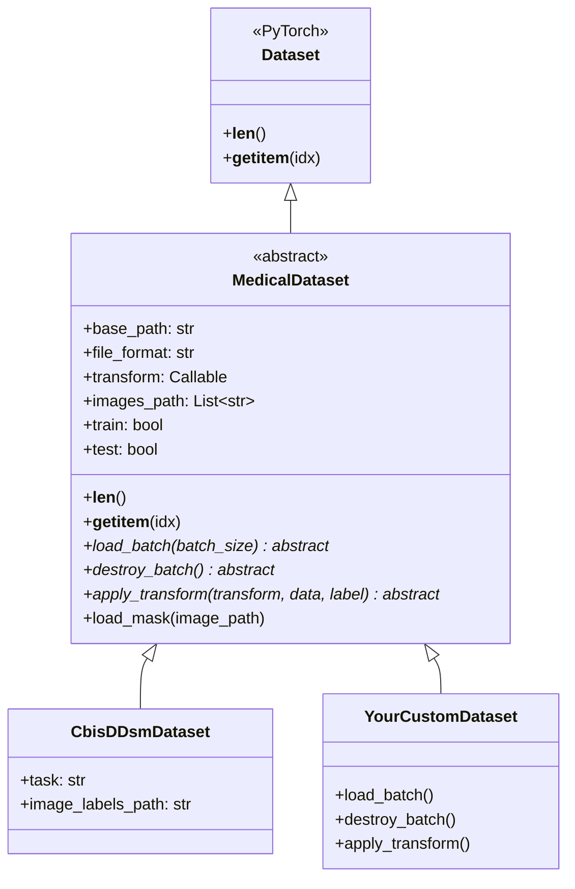
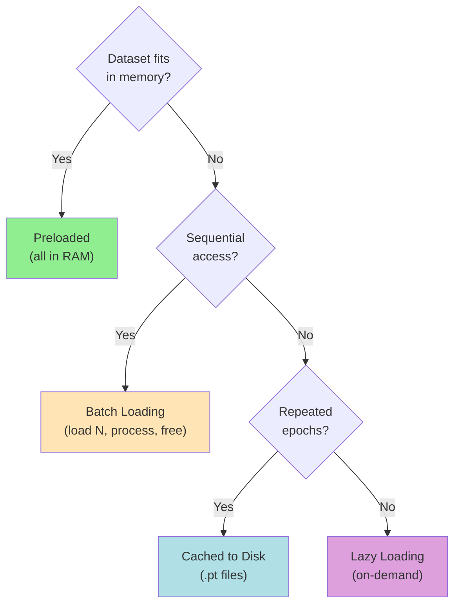

# Dataset Guide

## Overview

This guide covers working with medical image datasets in the Medical Image Standard Library, including the `MedicalDataset` base class, loading strategies, and the CBIS-DDSM mammography dataset.

---

## Table of Contents

1. [MedicalDataset Base Class](#medicaldataset-base-class)
2. [Dataset Loading Strategies](#dataset-loading-strategies)
3. [CBIS-DDSM Dataset](#cbis-ddsm-dataset)
4. [Creating Custom Datasets](#creating-custom-datasets)
5. [Annotations](#annotations)
6. [PyTorch Integration](#pytorch-integration)

---

## MedicalDataset Base Class

`MedicalDataset` is an abstract class that extends PyTorch's `torch.utils.data.Dataset`. It provides a standardized interface for medical image datasets with support for different annotation types, batch loading, and memory management.

### Class Signature

```python
class MedicalDataset(Dataset, ABC):
    def __init__(
        self,
        base_path: str,          # Root directory containing images
        file_format: str = ".dcm",  # File extension to scan for
        transform: Optional[Callable] = None,  # Transform pipeline
        train: bool = True,      # Training split flag
        test: bool = False,      # Test split flag
    ):
```

### Key Attributes

| Attribute | Type | Description |
|-----------|------|-------------|
| `base_path` | str | Root directory containing the dataset files |
| `file_format` | str | File extension filter (`.dcm`, `.png`, etc.) |
| `transform` | Callable or None | Optional transform applied to each sample |
| `images_path` | List[str] | Populated by subclasses with paths to image files |
| `image_labels` | Any | Label storage (format depends on subclass) |
| `current_image` | Image or None | Reference to the most recently loaded image |
| `train` / `test` | bool | Split flags for train/test partitioning |

### Abstract Methods

Subclasses **must** implement these methods:

| Method | Signature | Purpose |
|--------|-----------|---------|
| `load_batch` | `(batch_size) -> Image` | Load a batch of images into memory |
| `destroy_batch` | `() -> Image` | Free memory from the current batch |
| `apply_transform` | `(transform, pixel_data, label)` | Apply transforms to a sample |

### Built-in Methods

| Method | Purpose |
|--------|---------|
| `__len__()` | Returns dataset size |
| `__getitem__(idx)` | Returns `(pixel_data, label)` tuple, handles ROI extraction and annotation loading |
| `load_mask(image_path)` | Loads a corresponding binary mask from the mask directory |

### Architecture Diagram



### Annotation Support

`MedicalDataset.__getitem__()` supports three annotation geometry types:

| Type | `GeometryType` | Description |
|------|-----------------|-------------|
| Bounding Box | `BOUNDING_BOX` | `[x_min, y_min, x_max, y_max]` — crops via `RegionOfInterest` |
| Polygon | `POLYGON` | List of `(x, y)` points — crops via `RegionOfInterest` |
| Mask | `MASK` | Binary mask loaded from a parallel directory via `load_mask()` |

---

## Dataset Loading Strategies

Medical images are large (a single mammogram can be 50+ MB). The library supports multiple loading strategies to balance memory usage and speed.

### Strategy 1: Loading from Local Paths

The most common approach — point to a local directory of DICOM/PNG files:

```python
from medical_image.data.dicom_image import DicomImage
import os

# Scan a local directory for DICOM files
base_dir = "/data/mammograms"
paths = [os.path.join(base_dir, f) for f in os.listdir(base_dir) if f.endswith(".dcm")]

# Lazy-load individual images
image = DicomImage(paths[0])
image.load()  # pixel_data is now available
```

With `MedicalDataset`, subclasses populate `self.images_path` with local file paths in `__init__`. The base class `__getitem__` then loads each file on demand.

### Strategy 2: Lazy Loading (On-Demand)

**Best for:** Large datasets that do not fit in memory.

Images are loaded only when accessed. This is the library's default pattern — `Image.__init__()` stores the path, and `.load()` reads pixel data:

```python
class LazyDataset(MedicalDataset):
    def __init__(self, base_path, **kwargs):
        super().__init__(base_path, **kwargs)
        self.images_path = self._scan_directory()

    def __getitem__(self, idx):
        img = DicomImage(self.images_path[idx])
        img.load()  # I/O happens here, not at init time
        pixel_data = img.pixel_data
        if self.transform:
            pixel_data, _ = self.apply_transform(self.transform, pixel_data, None)
        return pixel_data

    # ... implement abstract methods ...
```

| Pros | Cons |
|------|------|
| Low memory footprint | I/O overhead per access |
| Scales to any dataset size | Slower iteration |

### Strategy 3: Batch Loading and Destruction

**Best for:** Medium-to-large datasets. Load a window of images, process them, then free memory.

```python
class BatchedDataset(MedicalDataset):
    def load_batch(self, batch_size):
        batch = []
        for i in range(batch_size):
            if self.current_index < len(self.images_path):
                img = DicomImage(self.images_path[self.current_index])
                img.load()
                batch.append(img)
                self.current_index += 1
        return batch

    def destroy_batch(self):
        self.current_image = None
        import torch
        torch.cuda.empty_cache()
```

| Pros | Cons |
|------|------|
| Balanced memory usage | Cache misses on random access |
| Reduced I/O overhead | More complex logic |

### Strategy 4: Preloaded (All in Memory)

**Best for:** Small datasets that fit in RAM/VRAM.

```python
class PreloadedDataset(MedicalDataset):
    def __init__(self, base_path, **kwargs):
        super().__init__(base_path, **kwargs)
        self.images_path = self._scan_directory()
        self.images = []
        for path in self.images_path:
            img = DicomImage(path)
            img.load()
            self.images.append(img)

    def __getitem__(self, idx):
        return self.images[idx].pixel_data
```

| Pros | Cons |
|------|------|
| Fastest access | High memory usage |
| No I/O during training | Slow initialization |

### Strategy 5: Automatic Caching

Cache preprocessed tensors to disk to avoid repeated DICOM parsing:

```python
import torch, os

CACHE_DIR = "/data/cache"

def load_cached(path):
    cache_path = os.path.join(CACHE_DIR, os.path.basename(path) + ".pt")
    if os.path.exists(cache_path):
        return torch.load(cache_path)
    img = DicomImage(path)
    img.load()
    torch.save(img.pixel_data, cache_path)
    return img.pixel_data
```

| Pros | Cons |
|------|------|
| Fast after first pass | Extra disk space |
| Avoids repeated DICOM parsing | Cache invalidation needed if data changes |

### Strategy Comparison



---

## CBIS-DDSM Dataset

### About CBIS-DDSM

**Full Name:** Curated Breast Imaging Subset of Digital Database for Screening Mammography

**Description:** A large-scale mammography dataset containing:
- 2,620+ scanned film mammography studies
- Calcification and mass abnormalities
- Expert annotations with pathology labels
- Multiple views (CC, MLO)
- DICOM format images

**Categories:**
- **Calcifications:** Microcalcifications and clusters
- **Masses:** Lesions and tumors

**Pathology Labels:**
- BENIGN
- BENIGN_WITHOUT_CALLBACK
- MALIGNANT

### Dataset Structure

```
CBIS-DDSM/
├── Calc-Training/
│   ├── Calc-Training_P_00001_LEFT_CC/
│   │   ├── 1-1.dcm
│   │   └── 1-2.dcm
│   └── ...
├── Calc-Test/
├── Mass-Training/
└── Mass-Test/
```

### Loading CBIS-DDSM

```python
from medical_image.data.cbis_ddsm import CbisDdsm

# Load training set
train_dataset = CbisDdsm(
    base_path="/path/to/CBIS-DDSM",
    train=True,
    test=False
)

# Load test set
test_dataset = CbisDdsm(
    base_path="/path/to/CBIS-DDSM",
    train=False,
    test=True
)

# Get dataset size
print(f"Training samples: {len(train_dataset)}")
print(f"Test samples: {len(test_dataset)}")
```

### Accessing Samples

```python
# Get a single sample
image, annotation = train_dataset[0]

# Image is a torch.Tensor
print(f"Image shape: {image.shape}")
print(f"Image dtype: {image.dtype}")

# Annotation contains metadata
print(f"Abnormality type: {annotation.abnormality_type}")
print(f"Pathology: {annotation.pathology}")
print(f"View: {annotation.image_view}")
```

### Working with Annotations

#### Calcification Annotations

```python
if annotation.abnormality_type == "calcification":
    print(f"Type: {annotation.calcification_type}")
    print(f"Distribution: {annotation.calcification_distribution}")
    print(f"Coordinates: {annotation.coordinates}")
```

**Calcification Types:**
- AMORPHOUS
- COARSE
- DYSTROPHIC
- EGGSHELL
- FINE_LINEAR_BRANCHING
- LUCENT_CENTERED
- PLEOMORPHIC
- PUNCTATE
- ROUND_AND_REGULAR
- SKIN
- VASCULAR

**Distribution Types:**
- CLUSTERED
- LINEAR
- REGIONAL
- DIFFUSELY_SCATTERED
- SEGMENTAL

#### Mass Annotations

```python
if annotation.abnormality_type == "mass":
    print(f"Shape: {annotation.mass_shape}")
    print(f"Margin: {annotation.mass_margin}")
```

**Mass Shapes:**
- ROUND
- OVAL
- LOBULATED
- IRREGULAR
- ARCHITECTURAL_DISTORTION

**Mass Margins:**
- CIRCUMSCRIBED
- MICROLOBULATED
- OBSCURED
- ILL_DEFINED
- SPICULATED

---

## Creating Custom Datasets

### Basic Custom Dataset

```python
from medical_image.data.medical_dataset import MedicalDataset
from medical_image.data.dicom_image import DicomImage
from medical_image.utils.annotation import Annotation, GeometryType
import os


class MyMammographyDataset(MedicalDataset):
    def __init__(self, base_path, transform=None, train=True):
        super().__init__(
            base_path=base_path,
            file_format='.dcm',
            transform=transform,
            train=train
        )

        # Load image paths
        self.images_path = self._load_image_paths()

        # Load annotations (if available)
        self.annotations = self._load_annotations()

    def _load_image_paths(self):
        """Scan directory for DICOM files."""
        paths = []
        for root, dirs, files in os.walk(self.base_path):
            for file in files:
                if file.endswith('.dcm'):
                    paths.append(os.path.join(root, file))
        return paths

    def _load_annotations(self):
        """Load annotation data from CSV or JSON."""
        # Implement based on your annotation format
        annotations = {}
        # ... load annotations
        return annotations

    def load_batch(self, batch_size):
        """Load a batch of images into memory."""
        # Implement batch loading logic
        batch = []
        for i in range(batch_size):
            if self.current_index < len(self.images_path):
                img = DicomImage(self.images_path[self.current_index])
                img.load()
                batch.append(img)
                self.current_index += 1
        return batch

    def destroy_batch(self):
        """Free memory from current batch."""
        self.current_image = None
        import torch
        torch.cuda.empty_cache()

    def apply_transform(self, transform, pixel_data, label):
        """Apply transformations to data."""
        if transform:
            pixel_data = transform(pixel_data)
        return pixel_data, label
```

### Dataset with CSV Annotations

```python
import pandas as pd

class CSVAnnotatedDataset(MedicalDataset):
    def __init__(self, base_path, csv_path, transform=None, train=True):
        super().__init__(base_path, '.dcm', transform, train)
        
        # Load CSV annotations
        self.df = pd.read_csv(csv_path)
        self.images_path = self.df['image_path'].tolist()
    
    def __getitem__(self, idx):
        # Load image
        image_path = self.images_path[idx]
        image = DicomImage(image_path)
        image.load()
        
        # Get annotation from CSV
        row = self.df.iloc[idx]
        
        # Create annotation object
        annotation = Annotation(
            annotation_type=AnnotationType.BOUNDING_BOX,
            coordinates=[[
                row['x_min'], row['y_min'],
                row['x_max'], row['y_max']
            ]],
            classes=[row['class']],
            image_view=row['view'],
            abnormality_type=row['abnormality_type'],
            pathology=row['pathology'],
            calcification_type=row.get('calc_type'),
            calcification_distribution=row.get('calc_dist'),
            mass_shape=row.get('mass_shape'),
            mass_margin=row.get('mass_margin')
        )
        
        # Apply transforms
        pixel_data = image.pixel_data
        if self.transform:
            pixel_data, annotation = self.apply_transform(
                self.transform, pixel_data, annotation
            )
        
        return pixel_data, annotation
    
    def load_batch(self, batch_size):
        # Implementation
        pass
    
    def destroy_batch(self):
        # Implementation
        pass
    
    def apply_transform(self, transform, pixel_data, label):
        return transform(pixel_data), label
```

---

## Annotations

### Annotation Types

The library supports three annotation types:

#### 1. Bounding Box

```python
from medical_image.utils.annotation import GeometryType

# Define bounding box [x_min, y_min, x_max, y_max]
bbox_coords = [[100, 100, 300, 300]]

annotation = Annotation(
    annotation_type=GeometryType.BOUNDING_BOX,
    coordinates=bbox_coords,
    classes=['calcification'],
    image_view='CC',
    abnormality_type='calcification',
    pathology='MALIGNANT',
    calcification_type='PLEOMORPHIC',
    calcification_distribution='CLUSTERED'
)
```

#### 2. Polygon

```python
# Define polygon as list of (x, y) points
polygon_coords = [
    [(100, 100), (200, 100), (200, 200), (150, 250), (100, 200)]
]

annotation = Annotation(
    annotation_type=AnnotationType.POLYGON,
    coordinates=polygon_coords,
    classes=['mass'],
    image_view='MLO',
    abnormality_type='mass',
    pathology='BENIGN',
    mass_shape='IRREGULAR',
    mass_margin='SPICULATED'
)
```

#### 3. Binary Mask

```python
import numpy as np

# Create binary mask
mask = np.zeros((512, 512), dtype=bool)
mask[100:300, 100:300] = True

annotation = Annotation(
    annotation_type=AnnotationType.MASK,
    coordinates=[mask],
    classes=['calcification'],
    image_view='CC',
    abnormality_type='calcification',
    pathology='MALIGNANT',
    calcification_type='AMORPHOUS',
    calcification_distribution='REGIONAL'
)
```

### Annotation Metadata

**Required Fields:**
- `annotation_type`: Type of annotation
- `coordinates`: Spatial information
- `classes`: Class labels
- `image_view`: Imaging view (CC, MLO, etc.)
- `abnormality_type`: 'calcification' or 'mass'
- `pathology`: Pathology classification

**Conditional Fields:**

For calcifications:
- `calcification_type`
- `calcification_distribution`

For masses:
- `mass_shape`
- `mass_margin`

---

## Data Loading Strategies

### Strategy 1: Load All at Once

**Best for:** Small datasets that fit in memory

```python
class PreloadedDataset(MedicalDataset):
    def __init__(self, base_path, transform=None):
        super().__init__(base_path, '.dcm', transform)
        
        # Load all images at initialization
        self.images = []
        for path in self.images_path:
            img = DicomImage(path)
            img.load()
            self.images.append(img)
    
    def __getitem__(self, idx):
        return self.images[idx].pixel_data, self.annotations[idx]
```

**Pros:**
- Fast access during training
- No I/O bottleneck

**Cons:**
- High memory usage
- Slow initialization

### Strategy 2: Lazy Loading

**Best for:** Large datasets

```python
class LazyDataset(MedicalDataset):
    def __getitem__(self, idx):
        # Load image on-demand
        img = DicomImage(self.images_path[idx])
        img.load()
        
        pixel_data = img.pixel_data
        annotation = self.annotations[idx]
        
        # Apply transforms
        if self.transform:
            pixel_data, annotation = self.apply_transform(
                self.transform, pixel_data, annotation
            )
        
        return pixel_data, annotation
```

**Pros:**
- Low memory footprint
- Scalable to large datasets

**Cons:**
- I/O overhead
- Slower training

### Strategy 3: Batch Caching

**Best for:** Medium to large datasets

```python
class BatchCachedDataset(MedicalDataset):
    def __init__(self, base_path, batch_size=32, transform=None):
        super().__init__(base_path, '.dcm', transform)
        self.batch_size = batch_size
        self.cache = {}
        self.current_batch_idx = -1
    
    def __getitem__(self, idx):
        batch_idx = idx // self.batch_size
        
        # Load new batch if needed
        if batch_idx != self.current_batch_idx:
            self._load_batch(batch_idx)
            self.current_batch_idx = batch_idx
        
        # Return from cache
        local_idx = idx % self.batch_size
        return self.cache[local_idx]
    
    def _load_batch(self, batch_idx):
        """Load a batch into cache."""
        self.cache.clear()
        
        start_idx = batch_idx * self.batch_size
        end_idx = min(start_idx + self.batch_size, len(self.images_path))
        
        for i, idx in enumerate(range(start_idx, end_idx)):
            img = DicomImage(self.images_path[idx])
            img.load()
            self.cache[i] = (img.pixel_data, self.annotations[idx])
```

**Pros:**
- Balanced memory usage
- Reduced I/O overhead
- Good for sequential access

**Cons:**
- Cache misses on random access
- More complex implementation

---

## PyTorch Integration

### Using with DataLoader

```python
from torch.utils.data import DataLoader
from medical_image.data.cbis_ddsm import CbisDdsm

# Create dataset
dataset = CbisDdsm("/path/to/CBIS-DDSM", train=True)

# Create DataLoader
dataloader = DataLoader(
    dataset,
    batch_size=16,
    shuffle=True,
    num_workers=4,
    pin_memory=True  # Pin host memory for faster GPU transfers
)

# Training loop
for epoch in range(num_epochs):
    for batch_idx, (images, annotations) in enumerate(dataloader):
        # images: torch.Tensor of shape (batch_size, H, W)
        # annotations: list of Annotation objects

        # Move to GPU
        images = images.to('cuda')

        # Training step
        # ...
```

**Pin memory at the image level:** If you are working with `Image` objects before
they enter the DataLoader, you can call `image.pin_memory()` to place the
underlying `pixel_data` tensor in page-locked (pinned) memory. This is especially
useful in custom `__getitem__` implementations where you return raw `Image` objects
and want the subsequent host-to-device transfer to be asynchronous:

```python
image = DicomImage(path)
image.load()
image.pin_memory()  # pin pixel_data for faster .to('cuda') later
```

### Custom Collate Function

```python
def custom_collate(batch):
    """Custom collate function for variable-sized images."""
    images = []
    annotations = []
    
    for img, ann in batch:
        images.append(img)
        annotations.append(ann)
    
    # Stack images (requires same size)
    images = torch.stack(images)
    
    return images, annotations

# Use with DataLoader
dataloader = DataLoader(
    dataset,
    batch_size=16,
    collate_fn=custom_collate
)
```

### Data Augmentation

```python
import torchvision.transforms as transforms

# Define transforms
transform = transforms.Compose([
    transforms.RandomHorizontalFlip(p=0.5),
    transforms.RandomRotation(degrees=15),
    transforms.RandomResizedCrop(size=512, scale=(0.8, 1.0)),
    transforms.Normalize(mean=[0.5], std=[0.5])
])

# Create dataset with transforms
dataset = CbisDdsm(
    "/path/to/CBIS-DDSM",
    transform=transform,
    train=True
)
```

### Batch Processing with Filters

For dataset-level preprocessing, `Filters.gaussian_filter_batch()` applies a
Gaussian filter to an entire batch of images in a single call. This is
significantly faster than filtering images one at a time because it leverages
batched convolution on the GPU.

```python
import torch
from medical_image.process.filters import Filters

# Assume images is a batched tensor of shape (B, 1, H, W)
images = torch.stack([dataset[i][0].unsqueeze(0) for i in range(batch_size)])

# Apply Gaussian filter to the full batch at once
smoothed = Filters.gaussian_filter_batch(images, sigma=1.5, device="cuda")
```

The `device` parameter controls where the convolution runs. If omitted, it
defaults to the device of the input tensor. The `truncate` parameter (default
4.0) controls the kernel size relative to sigma.

---

## Best Practices

### 1. Memory Management

```python
# Use batch loading for large datasets
dataset.load_batch(batch_size=32)

# Process batch
# ...

# Free memory -- destroy_batch should call torch.cuda.empty_cache() internally
dataset.destroy_batch()
```

**Using DeviceContext for automatic GPU memory management:**

`DeviceContext` is a context manager that clears the GPU cache on entry and exit,
tracks memory usage, and falls back to CPU automatically when CUDA is unavailable.
Wrap GPU-intensive sections with it instead of managing `torch.cuda.empty_cache()`
calls manually:

```python
from medical_image.utils.device import DeviceContext

with DeviceContext(device="cuda", fallback="cpu") as ctx:
    dataset.load_batch(batch_size=32)
    for image in batch:
        image.to(ctx.active_device)
        # ... process on GPU ...
    dataset.destroy_batch()
# GPU cache is cleared automatically on exit
```

### 2. Data Validation

```python
def validate_dataset(dataset):
    """Validate dataset integrity."""
    for i in range(len(dataset)):
        try:
            img, ann = dataset[i]
            assert img is not None
            assert ann is not None
        except Exception as e:
            print(f"Error at index {i}: {e}")

validate_dataset(train_dataset)
```

### 3. Stratified Splitting

```python
from sklearn.model_selection import train_test_split

# Split by pathology
benign_indices = [i for i, ann in enumerate(annotations) 
                  if ann.pathology == 'BENIGN']
malignant_indices = [i for i, ann in enumerate(annotations) 
                     if ann.pathology == 'MALIGNANT']

# Stratified split
train_idx, val_idx = train_test_split(
    range(len(dataset)),
    test_size=0.2,
    stratify=[ann.pathology for ann in annotations]
)
```

### 4. Caching Preprocessed Data

```python
import pickle

# Cache preprocessed dataset
def cache_dataset(dataset, cache_path):
    data = [(img, ann) for img, ann in dataset]
    with open(cache_path, 'wb') as f:
        pickle.dump(data, f)

# Load from cache
def load_cached_dataset(cache_path):
    with open(cache_path, 'rb') as f:
        return pickle.load(f)
```

---

## Troubleshooting

### Issue: Out of Memory

**Solution:**
```python
# Use lazy loading
# Reduce batch size
# Use batch caching strategy
# Clear cache regularly
```

### Issue: Slow Data Loading

**Solution:**
```python
# Increase num_workers in DataLoader
# Use SSD for data storage
# Preprocess and cache data
# Use batch loading
```

### Issue: Annotation Mismatch

**Solution:**
```python
# Validate annotations
# Check file paths
# Verify coordinate systems
# Ensure consistent naming
```

---

## Additional Resources

- [CBIS-DDSM Dataset](https://wiki.cancerimagingarchive.net/display/Public/CBIS-DDSM)
- [PyTorch Dataset Documentation](https://pytorch.org/docs/stable/data.html)
- [Medical Image Analysis Best Practices](https://www.sciencedirect.com/topics/medicine-and-dentistry/medical-image-analysis)
